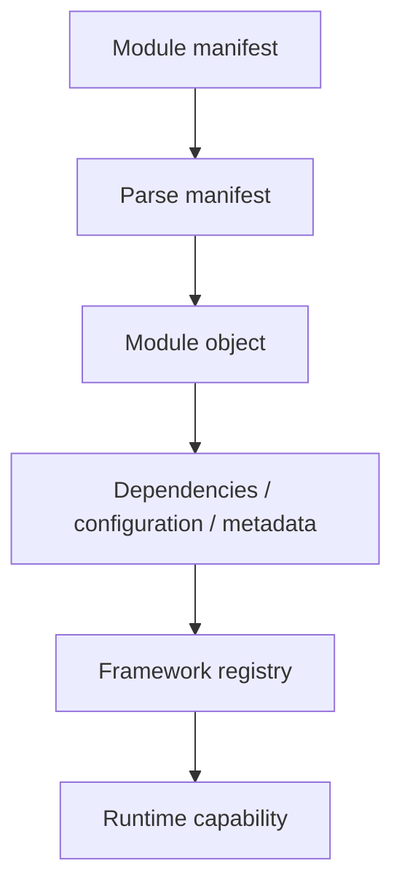
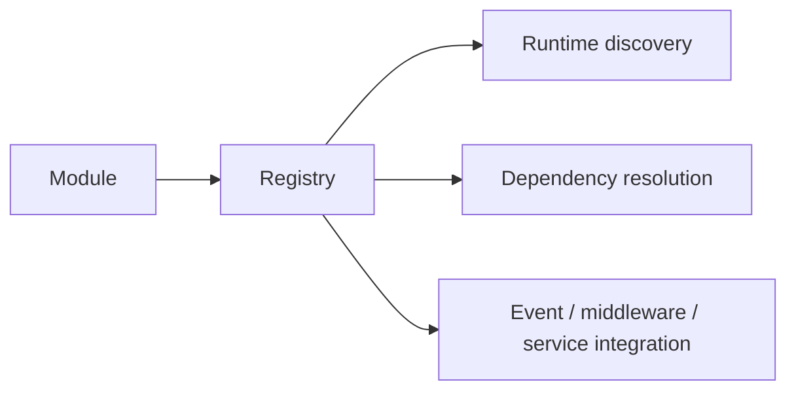

# 59. Modules, Manifests, and Scaffolding

A framework becomes extensible when functionality can be packaged and activated without modifying the kernel for every application feature.

SPP's module system is one of the main mechanisms for doing this.

## 59.1 A module is more than a directory

The current `SPP\Module` model includes concepts such as:

```text
name
version
description/group/category
dependencies
included files
configuration
settings
routes
service provider
runtime bridge configuration
assets
installation metadata
```

Therefore the useful mental model is:

> **A module is a declared unit of framework/application capability.**

## 59.2 Manifests describe the capability

The current module constructor accepts a manifest path and parses YAML module definitions.

The parser supports several legacy-friendly YAML shapes and maps fields into the module object.

This is an important source-first detail: current module manifests are YAML-based in this implementation; do not assume historical XML examples remain authoritative.

## 59.3 Module loading architecture

Conceptually:



The exact installation and compilation path depends on the module-management commands and supporting classes.

## 59.4 Dependencies

A module can declare dependencies.

That lets the framework reason about:

```text
Module A
   ↓ requires
Module B
```

Dependency metadata should be treated as a declaration that the loader/install system can consume—not as automatic proof that every dependency is available or correctly configured at runtime.

## 59.5 System and user module roots

The current module implementation maintains configurable search roots for system modules and permits additional module roots to be registered.

This supports an extensible repository layout without forcing every module into one hard-coded directory.

## 59.6 Disabling modules

The current `disableModule()` implementation removes the module's enabled registration and module object registration from the Registry.

This is runtime registry state manipulation.

It should not automatically be interpreted as uninstalling files, reversing database migrations, or removing all persistent state unless the surrounding module-management workflow explicitly does those things.

## 59.7 Configuration caching

`SPP\Module` maintains in-memory configuration/manifest caches.

Caching is important because module discovery can involve file parsing, but a cache also introduces a lifecycle question:

> **When does cached metadata become stale?**

The answer must come from the actual cache invalidation/build path rather than assumptions about frameworks in general.

## 59.8 Modules and the Registry

Modules register information into the runtime registry.

This produces a useful relationship:



The Registry is therefore one of the mechanisms through which modularity becomes runtime behavior.

## 59.9 Modules and events

The event system reads module registrations and can parse event definitions from module paths.

A module can therefore package not only classes but also event-driven behavior.

This is why module architecture should be learned together with Registry and Events rather than as a file-layout convention.

## 59.10 Modules and middleware

The middleware kernel also supports programmatic global middleware registration.

A module can participate in boot-time integration by registering middleware through the framework's exposed mechanism.

Again, the architecture is:

```text
module capability
      ↓
framework registration
      ↓
runtime behavior
```

## 59.11 Scaffolding and Maker

Scaffolding solves a different problem from module loading.

```text
Module system → runtime packaging/activation
Maker/scaffolding → developer-time generation
```

A generator can create the repetitive structure needed to build a module, controller, test, or other artifact while leaving the developer responsible for its behavior.

The exact command syntax should always be verified against the current CLI/Maker implementation.

## 59.12 Failure lab

Create a deliberately malformed module manifest.

The current module constructor rejects a missing manifest and rejects unsupported manifest formats.

Then create a valid manifest and compare the object state.

This teaches that module metadata is parsed and validated before the module can participate in runtime registration.

## 59.13 Parikshak exercise

For a small test module, verify:

```text
manifest is discovered
manifest fields are mapped
module dependency metadata is visible
module registration is visible
module can be disabled
module-provided event/middleware registration behaves as expected
```

Keep installation/destructive tests isolated from ordinary application tests.

## 59.14 Source trace

Start with:

```text
spp/core/class.module.php
spp/core/class.modulecompiler.php
spp/core/class.moduleinstaller.php
spp/core/class.registry.php
```

Then trace one real module from its manifest to its registry entry and finally to one runtime capability.

## 59.15 When not to create a module

A module boundary is useful when functionality is reusable, independently configurable, independently enabled, or architecturally separable.

Do not create a module merely to move three related PHP files into another directory.

For small application-local behavior, ordinary application code may be clearer.

## 59.16 Architectural takeaway

SPP modules combine **declared metadata + discovery/loading + registry integration + optional runtime capabilities**.

The module system is therefore part of the framework's composition model, not merely a packaging convention.
