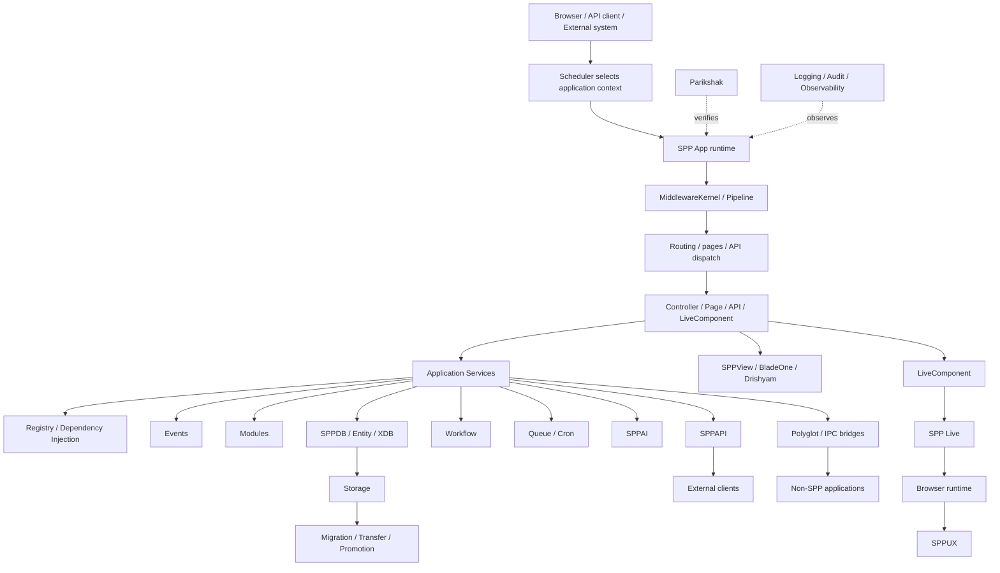

# 59. SPP Runtime — One Picture

This page is the map to return to whenever the framework feels too large.



## How to read this diagram

Start at the top.

A request or external interaction enters SPP. The Scheduler identifies the application context. The application runtime then applies shared infrastructure before handing control to the application-specific behavior.

The middle of the diagram is the important application layer:

```text
routing
→ controller/page/API/live action
→ service
→ framework subsystems
```

The bottom and side branches explain why SPP becomes more than a conventional MVC framework:

- reactive server-side components;
- a separate live transport architecture;
- a browser-side reactive runtime;
- persistent data/XDB;
- workflows;
- asynchronous work;
- AI integration;
- multiple application contexts;
- polyglot/external systems;
- offline-to-live promotion;
- testing and observability.

## The beginner mental model

If the whole diagram is too much, remember only this:

```text
Request
  ↓
SPP figures out which application should handle it
  ↓
SPP runs shared framework infrastructure
  ↓
Your application code runs
  ↓
SPP helps your code reach data, views, APIs, events, workflows, etc.
  ↓
A response or external effect is produced
```

Everything else in the handbook expands one box in this picture.
