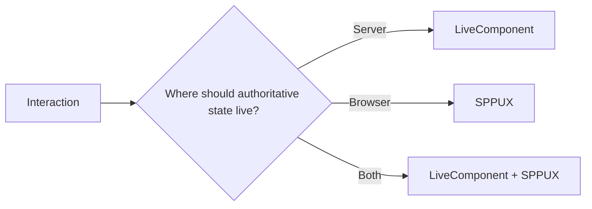
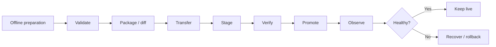

# 60. Production Readiness and Architecture Decisions

A framework tutorial teaches how to make a feature work. Production engineering asks a harder question:

> **Is this design appropriate under failure, load, security constraints, operational change, and long-term maintenance?**

This chapter provides a reusable decision framework for SPP applications.

## 60.1 Feature readiness checklist

Before calling a feature production-ready:

| Area | Questions |
|---|---|
| Correctness | Does the normal path work? |
| Validation | What invalid inputs are possible? |
| Authorization | Who is allowed to perform the operation? |
| Concurrency | What happens if two requests act at the same time? |
| Failure | What happens when a dependency fails? |
| Retry | Is retry safe? Is the operation idempotent? |
| Observability | Can operators tell what happened? |
| Testing | Is the important behavior covered by Parikshak? |
| Performance | What becomes expensive at scale? |
| Deployment | Can the feature be changed safely in production? |
| Recovery | Can the application be restored or rolled back? |

## 60.2 Choose the right SPP mechanism

Do not use a powerful subsystem merely because it exists.

| Need | Usually consider |
|---|---|
| Reuse business logic | Service / DI |
| Cross-cutting request behavior | Middleware |
| Decoupled reaction | Event |
| Feature packaging | Module |
| Persistent business data | Entity / SPPDB / XDB |
| User identity | Authentication / identity modules |
| Permission policy | Authorization / ACL |
| Long-running work | Queue / worker |
| Scheduled work | Cron / scheduler |
| Approval/state process | Workflow |
| Server-reactive UI | LiveComponent |
| Browser-local reactivity | SPPUX |
| Cross-system communication | API / IPC / bridge |
| Offline content promotion | Migration / transfer / promotion architecture |

The correct choice depends on the dependency relationship and failure model, not on the number of framework features used.

## 60.3 When to use an event instead of a service call

Use a direct service call when the caller requires a known collaborator and often its result.

Use an event when the publisher is announcing an occurrence or extension point and should not know all consumers.

Ask:

```text
Does the caller require the result?
    → direct call is often clearer.

Can consumers be added independently?
    → event may be appropriate.

Does a specific replacement implementation need to be selected?
    → dependency injection may be more appropriate.
```

## 60.4 When to use middleware

Middleware is appropriate when behavior surrounds request processing.

Examples include:

- authentication checks;
- rate limiting;
- CSRF checks;
- security headers;
- request logging;
- tenant/context resolution.

Do not put ordinary business workflows into global middleware merely because middleware can reach every request.

## 60.5 When to use LiveComponent versus SPPUX

A useful architectural question is where the state belongs.



The answer depends on validation, security, data ownership, latency, and the amount of browser-local state.

## 60.6 When to use queues

Move work out of the request when it is:

- slow;
- retryable;
- not required before the user receives a response;
- bursty;
- CPU-heavy or integration-heavy.

Examples:

```text
PDF/report generation
large exports
email delivery
external AI calls
bulk content processing
search re-indexing
```

The tutorial must also teach failure semantics:

```text
job created
→ execution
→ success
or
→ retry
→ eventual success/failure
```

## 60.7 Idempotency

Whenever a request or job may be retried, ask:

> “What happens if the same operation happens twice?”

Examples:

```text
create payment
send notification
promote content
write audit record
import external data
```

Idempotency is not an SPP-specific buzzword. It is an application correctness property that becomes essential when using retries, queues, distributed systems, or transfer workflows.

## 60.8 Multi-application decisions

Multiple SPP application contexts can be useful when boundaries are real.

Before creating another application, ask:

- Does it have an independent URL/base context?
- Does it need different configuration?
- Is there a genuine ownership boundary?
- Is deployment independence valuable?
- Would a module be sufficient instead?

Avoid creating multiple application contexts merely to organize folders.

## 60.9 Polyglot decisions

Use a non-SPP application when it provides a capability or runtime that is genuinely valuable:

```text
specialized ML runtime
existing Java service
Go worker
legacy platform
third-party managed API
```

Prefer the narrowest interface that satisfies the requirement.

```text
Need data exchange only?
    → API may be enough.

Need local process cooperation?
    → IPC may be appropriate.

Need framework-aware cross-runtime behavior?
    → bridge architecture may be appropriate.
```

## 60.10 Offline content promotion decisions

Treat content promotion as an operational lifecycle:



Do not assume that a database migration and a content promotion are the same operation. They can be related but have different operational concerns.

## 60.11 Production readiness for SPP reactive applications

A LiveComponent/SPP Live application should explicitly test:

```text
normal action
validation failure
server exception
transport timeout
client reconnect
stale state
concurrent actions
authorization failure
large payload
slow operation
```

Only document behaviors the implementation actually provides.

## 60.12 Architecture Decision Record template

For important SPP decisions, record:

```text
Decision:

Context:

Problem:

Options considered:

Chosen option:

Why:

Security implications:

Performance implications:

Failure/retry implications:

Operational implications:

Testing strategy:

Migration/reversal plan:
```

This is useful for questions such as:

- Why is this feature a module instead of application code?
- Why is this endpoint API rather than a page route?
- Why is this work queued?
- Why does this application use a separate context?
- Why does this UI use LiveComponent rather than SPPUX-only state?
- Why is offline promotion being used?

## 60.13 Definition of production-ready documentation

A feature should not be called production-ready in the handbook merely because the happy path runs.

The chapter should identify:

1. supported behavior;
2. assumptions;
3. known failure modes;
4. configuration requirements;
5. testing strategy;
6. observability;
7. deployment concerns;
8. rollback/recovery concerns.

This distinction protects the handbook from turning examples into unsupported platform guarantees.
