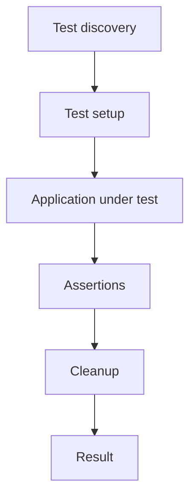
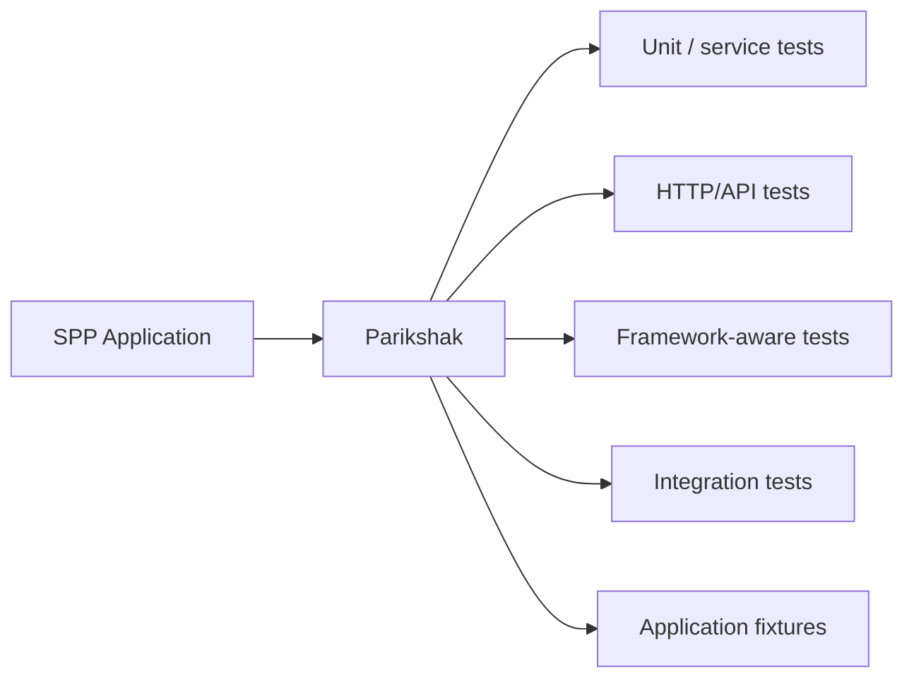
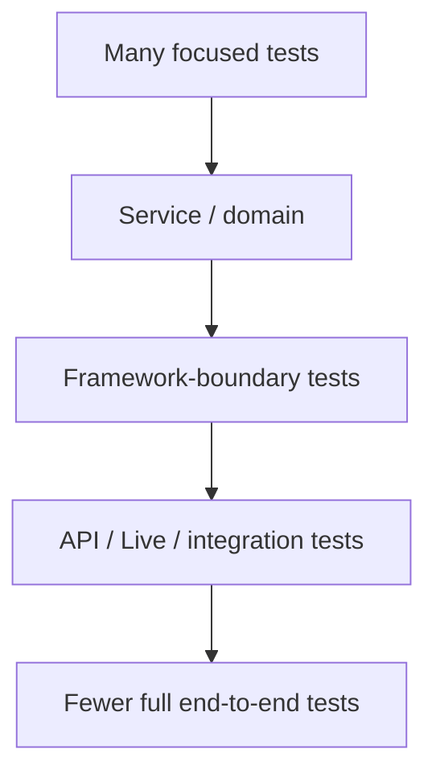

# 65 — Parikshak: The SPP Testing Engine

## 65.1 Why this is a separate architectural topic

In SPP, testing is not an afterthought attached to application code. **Parikshak is the primary SPP testing engine** and should be used as part of the normal development loop.

The handbook therefore treats Parikshak as a cross-cutting engineering subsystem, not merely as one chapter about unit tests.

The repository contains SPP-aware testing components including `TestCase`, `SPPTestCase`, `SPPTestResponse`, `SPPTestRunner`, `SPPFactory`, and database-refresh support. fileciteturn607file1L15-L34

## 65.2 What a testing engine does

A testing engine provides the infrastructure needed to run repeatable checks against software.

A generic lifecycle is:



Parikshak adds SPP-aware infrastructure around this lifecycle.

## 65.3 Parikshak in the SPP architecture



The exact test layer depends on the subsystem under test.

## 65.4 `TestCase` and `SPPTestCase`

The source/docs expose a base `TestCase` and an SPP-aware `SPPTestCase`. The SPP-aware layer is the appropriate conceptual starting point for tests that need framework/application behavior rather than only a standalone PHP class. fileciteturn607file0L2-L13

Do not automatically use the broadest test harness for every test. A small pure rule may be easier to test in isolation.

## 65.5 `SPPTestResponse`

Parikshak provides an `SPPTestResponse` abstraction for fluent assertions around HTTP or mocked responses. fileciteturn607file3L63-L65

This is particularly useful for testing the request boundary without driving a real browser.

Typical questions include:

```text
Did the request reach the correct route?
Was the response successful?
Did the expected payload/rendered result occur?
Was an unauthorized request rejected?
```

## 65.6 `SPPTestRunner`

The test runner discovers and executes Parikshak tests. The exact command syntax should be taken from the current repository's CLI/test surface.

The handbook intentionally avoids teaching historical runner flags unless they are verified against the current checkout.

## 65.7 `SPPFactory` and controlled test application state

Parikshak contains an `SPPFactory` abstraction and refresh-database support. These exist to make framework-aware tests reproducible.

The architectural principle is:

> **A test should create the environment it needs instead of depending on uncontrolled developer or production state.**

## 65.8 Why Parikshak belongs throughout the handbook

Every major SPP feature can be learned through the same loop:

```text
Understand
   ↓
Build
   ↓
Test with Parikshak
   ↓
Deliberately break
   ↓
Diagnose
   ↓
Trace source
   ↓
Repair
```

This is more educational than teaching all testing at the end.

## 65.9 Route testing

For routing, test:

```text
method
URL
context
handler selection
status/response
```

The repository already treats routing as a testable boundary; use Parikshak after defining the route rather than relying only on manual browser navigation. The route chapter should remain the primary routing tutorial.

## 65.10 Middleware testing

A middleware test should establish whether it:

- permits the intended request;
- rejects the intended invalid request;
- calls the next layer when required;
- stops the pipeline when required.

This lets you diagnose middleware without confusing it with the controller under test.

## 65.11 Event testing

Test event behavior as behavior:

```text
event dispatched
→ listener reached
→ priority/order as required
→ payload changed or preserved
→ propagation stopped or continued
```

Avoid tests that merely assert that an event class exists.

## 65.12 Dependency-injection testing

When a service is resolved through the container/Registry, test both:

1. the service's own behavior; and
2. the framework resolution path when that resolution is part of the contract.

A pure unit test should not require the entire application boot when it can prove the rule independently.

## 65.13 Persistence testing

For Task Desk persistence, use controlled records and verify:

```text
create
read
update
delete
validation rejection
authorization rejection
migration assumptions where relevant
```

When database refresh support is used, record the actual mechanism rather than describing it generically as “reset the database.”

## 65.14 Authentication and authorization tests

Security tests must test the **decision boundary**, not only the login page.

At minimum distinguish:

```text
anonymous
authenticated but unauthorized
authorized
invalid/expired token where applicable
```

A visible UI control is not an authorization test.

## 65.15 API tests

API tests should establish the actual API path:

```text
API request
→ authentication/exposure
→ middleware
→ HTTP-method dispatch
→ application service
→ response
```

This is where `SPPTestResponse` is particularly useful.

## 65.16 LiveComponent tests

For LiveComponent, separate:

- initial render;
- state hydration/dehydration;
- action invocation;
- validation;
- response/instruction creation;
- asynchronous live transport where used.

Do not use a WebSocket integration test when the defect can be isolated to component state serialization.

## 65.17 SPP Live transport tests

Transport tests should distinguish:

```text
publishing an event
from
successfully delivering an event
from
browser applying an update
```

The transport engine is only one layer in the chain.

## 65.18 SPPUX tests

Browser behavior is a separate runtime. Test the browser/runtime boundary for:

- DOM updates;
- event handling;
- local reactive state;
- bridge behavior;
- error boundaries.

Then use an integration test when you need to establish that SPPUX and the server actually cooperate.

## 65.19 Queue/Cron/worker tests

Background work should be tested for:

```text
job creation
payload integrity
execution
failure
retry behavior where implemented
idempotency where required
```

Do not infer retry semantics from the existence of a worker class.

## 65.20 AI tests

For SPPAI, separate provider-independent application behavior from provider-specific behavior.

For example:

```text
Task classifier input
→ AI service contract
→ structured result
→ application decision
```

The test should not claim that an arbitrary external model is deterministic when the provider is not under your control.

## 65.21 Deliberate failure testing

A strong SPP test suite includes controlled failures.

Examples:

- missing module;
- wrong route;
- denied permission;
- invalid payload;
- unavailable dependency;
- persistence failure;
- transport failure;
- malformed external response.

The important assertion is often **where the failure occurs** and whether the application reacts as designed.

## 65.22 Test pyramid for an SPP application



This is guidance, not an SPP-enforced rule. The correct mix depends on the feature.

## 65.23 What Parikshak should replace

The goal is not to ban every external testing tool. The goal is to establish one **SPP-native testing backbone**.

Parikshak should be the default first choice when you need to test SPP framework/application behavior. A specialist external tool can still be useful when the test concerns a subsystem for which another tool has a strong ecosystem.

## 65.24 Coming from other frameworks

### PHPUnit

Parikshak provides an SPP-oriented layer around framework-aware testing. Familiar assertion/test concepts remain useful.

### Laravel

Think of the role played by Laravel's application test infrastructure, but follow SPP's own `SPPTestCase`, response, factory, and runner contracts.

### Symfony

The analogous idea is a framework-aware testing layer around controllers/services/kernel behavior.

### Django

Django's test client mental model is useful when learning SPP HTTP/API tests; the actual Parikshak APIs are different.

## 65.25 Completion assignment

Take the Task Desk create-task operation and produce:

1. a focused service/domain test;
2. an SPP-aware request/API test where applicable;
3. an authorization failure test;
4. a persistence failure or invalid-input test;
5. one deliberately broken configuration/dependency test;
6. a short source trace explaining why the observed failures occur where they do.

You are finished only when the tests teach you something about the framework boundary.

## Kernel Hacker source map

Start with:

```text
spp/modules/spp/parikshak/src/TestCase.php
spp/modules/spp/parikshak/src/SPPTestCase.php
spp/modules/spp/parikshak/src/SPPTestResponse.php
spp/modules/spp/parikshak/src/SPPTestRunner.php
spp/modules/spp/parikshak/src/SPPFactory.php
spp/modules/spp/parikshak/src/RefreshDatabase.php
```

The repository's Parikshak handbook/reference material should be used alongside these source landmarks. fileciteturn607file1L15-L34
