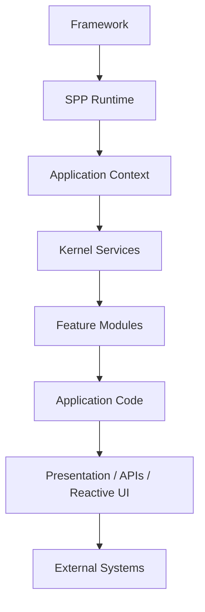
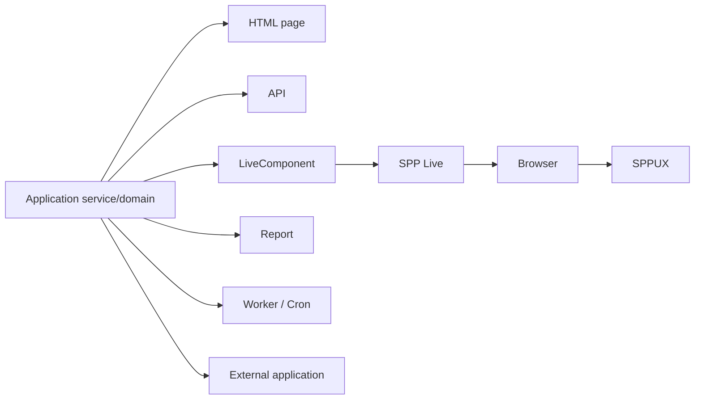
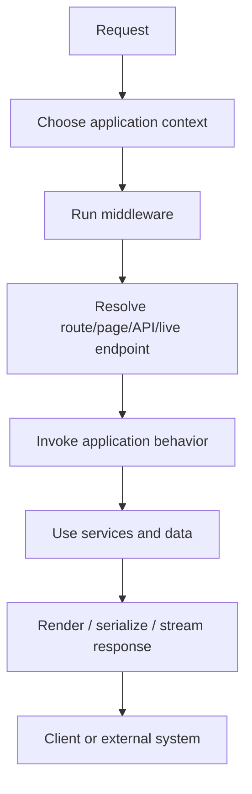
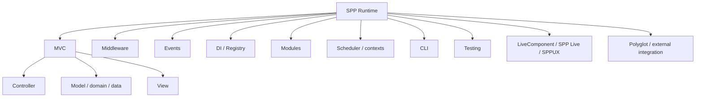

# 65. The SPP Mental Model

This chapter is the map to keep in your head while reading the rest of the handbook.

A framework is not magic. It is a collection of reusable runtime rules and tools that take repeated application problems—request handling, routing, object construction, configuration, persistence, testing, rendering, security, background work—and provide consistent infrastructure for them.

SPP builds a larger runtime around those familiar framework ideas.

## The hierarchy

A beginner should read this from top to bottom.

### Framework

The framework is the reusable infrastructure.

It is the thing you install once and use to build many applications.

### Runtime

The runtime is the machinery that is active while an application runs.

It includes concepts such as scheduling/context selection, middleware, events, service resolution, module loading, routing and rendering.

### Application context

An SPP application is a named runtime context with its own identity, paths, configuration, services and modules.

The Scheduler determines which application context is active for a request.

### Kernel services

These are reusable mechanisms that solve cross-cutting problems:

| Problem | SPP mechanism |
|---|---|
| Which application handles the request? | Scheduler / application context |
| What happens before the handler? | Middleware Pipeline |
| How does one subsystem react to another? | SPPEvent |
| How are services constructed? | App / Registry / DI |
| How are reusable features packaged? | Modules |
| How is configuration loaded? | Config/settings layers |
| How is a request mapped to behavior? | Routing/page/API machinery |
| How is a response rendered? | SPPView / BladeOne / Drishyam |
| How is behavior tested? | Parikshak |

### Feature modules

SPP modules add substantial capabilities such as authentication, XDB, API, workflow, queueing, reporting, AI, LiveComponent, and other framework/application services.

A module is more than a random folder. Its purpose is to package reusable behavior and metadata so the framework can discover and activate it according to its contracts.

### Application code

This is the code you write for your business problem:

- controllers/handlers;
- services;
- entities/data access;
- forms;
- event listeners;
- modules local to an application;
- views;
- commands;
- tests.

### Presentation and integrations

An SPP application can expose the same business capability through multiple surfaces:

This is why the handbook does not equate "SPP application" with "MVC website".

## The most useful mental model

Think of a request as moving through layers of responsibility:

At each layer, ask:

> **What problem is this layer solving, and why should the next layer not solve it instead?**

That question is one of the best ways to learn framework architecture.

## SPP versus MVC

MVC is an application-organization pattern.

SPP is a runtime/framework architecture that can support MVC-style applications and extends beyond it.

Therefore:

> **Learning MVC teaches one important SPP application pattern; learning SPP teaches the runtime surrounding that pattern.**

## Source-reading rule

When a feature is confusing, locate it in this order:

1. the public API used by application code;
2. the configuration or manifest that activates it;
3. the runtime component that dispatches it;
4. the tests that demonstrate its behavior;
5. the lower-level implementation.

This prevents beginners from starting with the most complicated class in the framework and mistaking implementation detail for the public programming model.

## Checkpoint

Before moving on, you should be able to explain, without using framework jargon:

- what a framework is;
- why a request needs routing;
- why middleware exists;
- why events exist;
- why dependency injection exists;
- why modules exist;
- why a framework has a runtime at all;
- and why SPP is larger than MVC.
