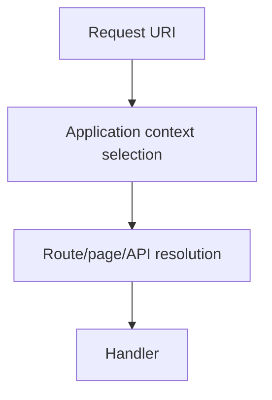

# 66 — Routing as a Multi-Paradigm Architecture

## 66.1 Routing is more than a URL table

Routing answers a deceptively simple question:

> **Given an incoming address and execution context, what should SPP invoke?**

In SPP, that answer can be assembled through several paradigms. The important architectural point is that **routing definition** and **route generation** are different concerns.

## 66.2 The current routing families

The repository documentation and source describe at least these routing approaches:

| Paradigm | Where the developer expresses intent | Main strength |
|---|---|---|
| `pages.yml` / page configuration | Application configuration | Central declarative page catalog |
| `#[Route]` attributes | PHP controller/class metadata | Route declaration close to code |
| API routing/exposure | API subsystem and entity/controller metadata | Structured HTTP/API boundary |
| CLI/scaffolding | SPP command interface | Generates the artifacts used by the runtime |

These are not all interchangeable and should not be forced into one syntax.

## 66.3 The important separation

```mermaid
flowchart LR
    A[Developer intent] --> B{Definition paradigm}
    B --> C[pages.yml]
    B --> D[#[Route]]
    B --> E[API exposure/dispatch]
    F[CLI] --> G[Generated artifacts]
    G --> C
    G --> D
    C --> H[Routing/runtime]
    D --> H
    E --> I[API request/runtime]
    H --> J[Application operation]
    I --> J
```

The CLI creates or scaffolds artifacts. The routing runtime later interprets the resulting configuration/metadata.

## 66.4 `pages.yml`

`pages.yml` is a central configuration style. It is useful when a team wants a visible page catalog or when the page definition is naturally declarative.

The handbook should teach it as **configuration-driven routing/page registration**, not as the one and only SPP routing mechanism.

A beginner should learn to inspect:

- application ownership;
- path/base URL;
- page/handler target;
- method where applicable;
- middleware association;
- view/response behavior.

The exact keys should come from the current application and module conventions being used.

## 66.5 Attribute routing

SPP contains `AttributeRouter` and a `#[Route]` attribute. The current implementation recursively scans the application source and builds a route map that is cached per application.

This gives a code-local model:

```php
#[Route('/tasks', method: 'GET', name: 'tasks.index')]
public function index()
{
    // application behavior
}
```

The example is representative; the exact controller type and scanner conventions should be verified in the current repository.

## 66.6 Route discovery and cache

The attribute router has a cache file of the form:

```text
var/cache/routes_<app>.php
```

This is architecturally important because it means there are two phases:

```text
source metadata
   ↓
route discovery/scanning
   ↓
cached route map
   ↓
request-time lookup
```

Therefore a routing defect may be caused by either source metadata **or stale/incorrect generated route state**.

## 66.7 CLI route generation

CLI generation should be taught as a developer-experience layer:

```text
developer
   ↓
SPP CLI
   ↓
scaffold/template
   ↓
controller/config/page artifact
   ↓
routing discovery
```

The generated artifact is the thing the runtime understands; the CLI is not itself the router.

## 66.8 Routing and application context

Routing must be understood after application-context selection.



This matters especially when multiple SPP applications share one installation. A path may first determine **which application is active**, then determine **which route inside that application** handles the request.

## 66.9 Routing versus middleware

Routing says **what** should handle the request.

Middleware says **what must happen around or before that handling**.


Exact ordering can vary by the concrete runtime path; the diagram is the conceptual distinction, not a statement that all SPP execution modes have identical call order.

## 66.10 Routing versus authorization

A route being registered does not mean it is publicly accessible.

Keep these decisions separate:

```text
route exists?
    ↓
request may reach handler?
    ↓
caller authenticated?
    ↓
caller authorized?
```

The last two belong to security/authentication/authorization boundaries, not route existence itself.

## 66.11 Route parameters

Dynamic routes introduce parameter binding:

```text
/tasks/{id}
```

The application then decides whether the parameter should be interpreted as an integer, identifier, slug, path segment, or another domain key.

Never assume a route parameter is safe merely because the router matched it. Validate and authorize its use in the application operation.

## 66.12 Route collision

Multiple routing paradigms increase expressive power but also increase the importance of deterministic precedence.

A route collision can happen when two definitions accept the same request.

The handbook should therefore document, from the current implementation:

- how definitions are merged;
- how precedence is determined;
- what happens on duplicate names/paths;
- whether route order is stable after compilation/cache generation.

Do not invent a universal precedence rule when the current router source has not established one.

## 66.13 Route debugging workflow

When a route does not work:

1. confirm the active application context;
2. confirm the request URL and HTTP method;
3. confirm the definition exists in its source paradigm;
4. confirm the route discovery/compiled cache is current;
5. confirm middleware is not short-circuiting the request;
6. confirm the selected handler exists and is invokable;
7. confirm authorization is not intentionally rejecting it.

This avoids the common mistake of changing the route when the real problem is application selection or middleware.

## 66.14 Parikshak routing tests

For each important route test:

```text
context
+ URL
+ method
+ expected handler/response
+ authentication state
+ authorization state
+ invalid parameter behavior
```

The repository provides an SPP-aware Parikshak testing layer; use the current test API from its source/reference rather than assuming a PHPUnit-compatible surface.

## 66.15 Coming from other frameworks

### Laravel / Symfony

The equivalent mental model is route registration plus middleware/security plus controller dispatch. The difference is that SPP supports multiple route-definition paradigms that can coexist with CLI/scaffold tooling.

### Django

URL configuration is the closest analogue to central route configuration. SPP's attribute route scanner adds another code-local paradigm.

### Rails

Rails conventions are useful for understanding route-to-controller mapping, but SPP should not be assumed to use Rails precedence or conventions.

### FastAPI / NestJS

The code-local decorator/attribute idea maps naturally to `#[Route]`, while SPP still retains configuration-driven page routing.

## 66.16 When to choose which paradigm

Prefer **pages/configuration** when central declarative control is valuable.

Prefer **attributes** when route metadata naturally belongs with controller code.

Prefer **CLI scaffolding** when you need to create the conventional artifacts quickly.

Prefer the **API subsystem** when the operation is part of an explicit API contract rather than a normal HTML page.

A mature SPP application can use more than one paradigm deliberately.

## 66.17 Kernel Hacker source map

Start with:

```text
spp/modules/spp/sppview/class.attributerouter.php
spp/core/attributes/Route.php
spp/commands/
spp/commands/stubs/
documentation/framework/routing-engine.md
```

Then trace the actual route/page resolver used by the target application.

## 66.18 Completion exercise

Implement the same Task Desk list endpoint through two supported paradigms.

Then answer:

```text
Where is each route declared?
How is each discovered?
Where is the route map cached?
How does application context affect it?
What middleware protects it?
How does Parikshak prove the expected dispatch?
```

The result should be an architectural understanding of routing, not a preference for one syntax.
