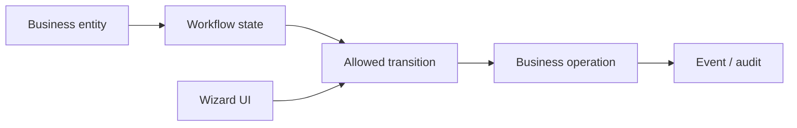
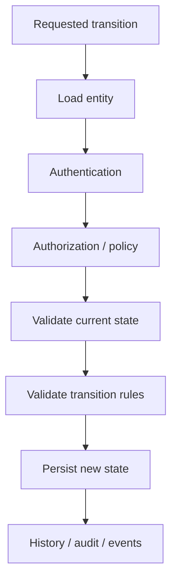
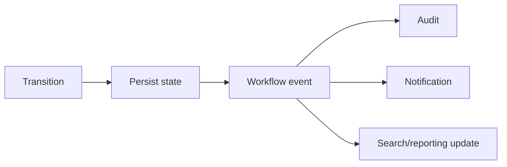

# 67 — Workflow, Approval Chains, Wizards, and State Machines

## Why workflow is different from UI state

A workflow describes **which business states are legal and which transitions are allowed**.

A UI wizard describes **how a person moves through an interaction**.

They can cooperate, but they are not the same abstraction.



The same workflow can therefore be triggered by a normal page, SPPAPI, LiveComponent, SPPUX, a CLI operation, or a background process when those entry points are wired into the application.

## 67.1 Start with a state machine

Task Desk example:

```text
Draft → Submitted → Approved → Completed
          ↓
       Rejected
```

The key design question is not “which button should I show?” It is:

> **Which transitions are legal for this entity and this actor?**

The repository contains workflow management, approval-chain, wizard/controller, timeout, and related command/documentation surfaces. The exact runtime contract should be traced from the current implementation before claiming broader guarantees.

## 67.2 Transition as a domain operation

A useful transition pipeline is:



This keeps workflow rules out of UI-only code.

## 67.3 Approval chains

An approval chain adds a policy-driven sequence of decisions, for example:

```text
Requester
   ↓
Team lead
   ↓
Department approver
   ↓
Final approver
```

The important distinction is between:

- **approval responsibility**;
- **workflow state**;
- **user interface**; and
- **authorization to act**.

An actor may be authenticated but not be the approver for the current transition.

## 67.4 Wizards

A wizard is an interaction pattern for multi-step input.

```text
Step 1 → Step 2 → Step 3 → Confirmation
```

A wizard should preserve enough state to continue the interaction, but it should not become the authoritative store for business workflow state.

Prefer:

```text
Wizard step state
    ↓
Validated command
    ↓
Workflow transition
    ↓
Persistent business state
```

rather than allowing browser/session state to determine which business transitions are legal.

## 67.5 Timeouts and SLA processing

The repository documentation exposes workflow timeout processing as an asynchronous operation that can evaluate entities beyond configured SLA windows and initiate escalation transitions. fileciteturn613file2L48-L72

Treat timeout processing as **background workflow work**, not as part of the user's interactive request path.

A robust design distinguishes:

```text
interactive transition
vs.
automated timeout transition
```

They can share transition rules but have different invocation context and observability.

## 67.6 Saga and compensation: document carefully

Repository documentation also describes a saga rollback engine that inspects transition history and can invoke compensation/rollback behavior. fileciteturn613file4L102-L119

That establishes an implementation/documentation surface. It does not, by itself, prove atomic rollback across arbitrary external systems.

The handbook should use language such as:

> “SPP provides saga/compensation mechanisms for workflows that need compensating actions.”

and avoid:

> “SPP provides distributed transactions with atomic rollback.”

## 67.7 Workflow state, database state, and audit state

Keep these concepts distinct:

| State | Question |
|---|---|
| Current entity state | What is true now? |
| Workflow state | Which business stage is the entity in? |
| Transition history | How did it get here? |
| Audit record | Who performed which action? |
| UI state | What is the user currently seeing? |

They may all be persisted, but they answer different questions.

## 67.8 Workflow and events

A transition can emit an event:



Do not use events to secretly redefine the state machine. The transition itself should remain the authoritative business operation.

## 67.9 Workflow and queues

Long-running or external work should not unnecessarily block a state transition.

For example:

```text
Approve report
   ↓
Persist Approved
   ↓
Dispatch report-generation job
```

The approval is a business transition. Report generation is background work.

This distinction makes retries and failure handling much easier to reason about.

## 67.10 Testing with Parikshak

For every workflow, test the state graph rather than only the happy path.

Minimum matrix:

```text
valid transition
invalid transition
unauthorized actor
wrong current state
missing required data
approval rejection
approval retry
timeout escalation
compensation path where implemented
repeated transition
concurrent-sensitive transition where applicable
```

A strong Parikshak test names the business contract explicitly:

```text
Given task.status = Submitted
and the actor is an authorized approver
When Approve is requested
Then the task becomes Approved
And the transition is recorded
```

## 67.11 Deliberate failure lab

Break one rule at a time:

1. remove a legal transition;
2. change the expected current state;
3. use an unauthorized actor;
4. remove a required approval step;
5. force a timeout handler to receive an unexpected state;
6. make the compensation target unavailable.

Then identify whether failure occurred in:

```text
authorization
→ state validation
→ transition rules
→ persistence
→ event/history
→ background/compensation
```

## 67.12 CLI as workflow tooling

The repository documents workflow CLI operations including configuration synchronization, workflow visualization, and timeout processing. fileciteturn613file2L48-L72

Teach these commands as **operator/developer interfaces to workflow infrastructure**, not as the workflow itself.

The exact command syntax must follow the current command implementation in the checkout being documented.

## 67.13 When not to use workflow

A two-state flag such as:

```text
active / inactive
```

may not need a workflow subsystem.

Introduce a state-machine model when there are enough rules, transitions, actors, approvals, timeouts, or audit requirements to justify it.

## 67.14 Coming from other frameworks

### Laravel

Think state-machine packages, policies, jobs, and events working together rather than one Laravel feature mapping to the whole SPP workflow system.

### Symfony

Workflow component concepts map well to states and transitions, while SPP adds its own surrounding approval/wizard/timeout architecture.

### Django

Model methods and service-layer state changes can provide a similar baseline, but an explicit workflow subsystem becomes valuable as transition rules grow.

## Kernel Hacker note

Trace a transition from the invocation point to the persistence and history path. Then trace timeout and compensation callers separately.

Never infer a transaction/distributed-consistency guarantee merely from the existence of a saga, rollback, or workflow history class.
