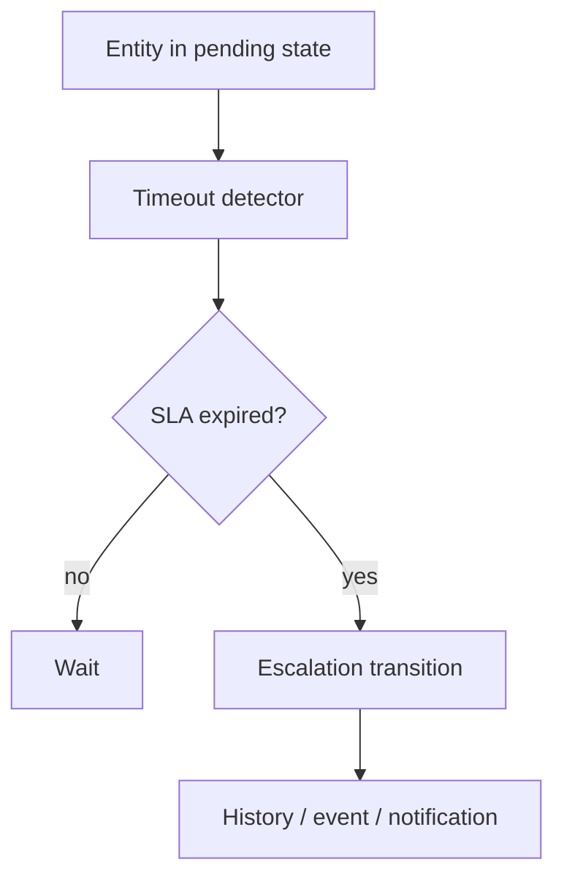

# 68 — Queue, Cron, Workers, and Background Execution

## Why background execution exists

A web request should finish as quickly as the user-facing operation requires. Work that can safely happen later can be moved out of the request path.

Examples include:

- report generation;
- batch processing;
- notifications;
- media processing;
- synchronization with an external service;
- periodic cleanup.

The architectural distinction is:

```text
interactive request
       ↓
small synchronous operation
       ↓
optional background job
```

## 68.1 Queue versus Cron versus worker

These concepts are related but different.

| Mechanism | Main question |
|---|---|
| Queue | What work is waiting to be processed? |
| Worker | Which long-running process executes queued work? |
| Cron | When should scheduled work be started? |
| Scheduler/context | Which SPP application/runtime context is active? |

A worker is not a queue. Cron is not a worker. Scheduler context is not a distributed job broker.

## 68.2 SPPQueue

Repository documentation exposes `SPPQueue` and shows worker execution through its `work()` method. fileciteturn615file0L2-L23

The conceptual flow is:


The concrete queue backend, locking, retry, visibility, and delivery semantics must be documented from the current implementation rather than inferred from the abstraction name.

## 68.3 Worker lifecycle

A worker usually has a loop similar to:

```text
start
  ↓
obtain work
  ↓
execute job
  ↓
record outcome
  ↓
repeat
```

The repository's SPPQueue documentation demonstrates a loop invoking `SppQueue::work()` and sleeping between passes. fileciteturn615file0L8-L23

Do not infer from a loop that the worker is automatically fault-tolerant, horizontally scalable, or exactly-once.

## 68.4 Cron scheduling

Cron is appropriate when the requirement is temporal:

```text
Every hour → inspect overdue tasks
Every night → generate daily report
Every Sunday → cleanup temporary files
```

A scheduled task can enqueue work rather than performing a long operation inline:


## 68.5 Keep request work small

A useful rule is:

> **The request should perform what the caller must know now; background execution should perform what can safely happen later.**

For example:

```text
POST /reports/42/generate
    ↓
validate + authorize
    ↓
record generation request
    ↓
queue report job
    ↓
return accepted/status response
```

Do not move authorization itself into the worker merely because the actual work is asynchronous.

## 68.6 Idempotency

Retries can repeat a job. Therefore, important background operations should have a safe repeated-execution strategy.

Examples:

```text
send notification
→ use a unique delivery key

create export file
→ deterministic target/revision or overwrite-safe operation

update external system
→ use an idempotency key when the protocol supports it
```

The framework's existence of a queue does not automatically make application operations idempotent.

## 68.7 Failure handling

Separate these cases:

```text
job failed before execution
job failed during execution
job timed out
job was retried
job eventually succeeded
job permanently failed
```

The exact retry and failure-state behavior must be read from the current queue implementation.

## 68.8 Workflow and background execution

Workflow timeouts are a good example of why background execution matters. Repository documentation exposes `workflow:process-timeouts` as an asynchronous process that evaluates SLA windows and initiates escalation transitions. fileciteturn613file2L48-L72

The conceptual model is:



## 68.9 Long-running workers and application context

If a worker serves more than one application, its context must be explicit and must not leak from one job to another.

A safe conceptual pattern is:

```text
job A
 → application A context
 → execute
 → restore/clear

job B
 → application B context
 → execute
 → restore/clear
```

Use SPP's scoped context mechanisms where the current runtime makes them appropriate.

## 68.10 External calls

Background jobs are often useful for external integrations because they can tolerate latency better than an interactive request.

But moving the work to a queue does not solve every reliability problem.

The job should define:

- timeout;
- retry policy;
- idempotency;
- authentication;
- error handling;
- audit/observability.

## 68.11 Testing with Parikshak

Test the job handler independently where possible.

Then test the queue boundary:

```text
enqueue → job becomes visible
worker → job executes
success → completion recorded
failure → failure recorded
retry → repeated execution is controlled
```

For a workflow timeout job, test:

```text
not expired → no transition
expired → escalation transition
already escalated → no duplicate transition
```

## 68.12 Deliberate failure lab

Introduce one failure at a time:

1. make the job handler throw;
2. make an external dependency time out;
3. make the job receive malformed data;
4. make the worker lose access to its queue storage;
5. force a duplicate delivery.

For each failure, record:

```text
What happened?
Was the job retried?
Was business state changed?
Was the operation idempotent?
What evidence did the logs/audit provide?
```

## 68.13 Observability

A useful background-operation record should let an operator answer:

```text
What job?
Which application?
Which entity?
Who initiated it?
When was it queued?
When did a worker start it?
How many attempts?
Why did it fail?
What was the final state?
```

The actual fields provided by SPP must be verified from its queue/logging implementation.

## 68.14 CLI and operational tooling

The SPP CLI exposes queue/worker-oriented commands in the current command surface, and generated API documentation includes `QueueWorkCommand`. fileciteturn615file2L47-L64

Treat CLI operations as administrative interfaces to the background-execution system. Do not treat them as evidence of distributed queue guarantees.

## 68.15 When not to use a queue

Do not queue tiny, deterministic work merely because asynchronous execution is available.

If the user needs the result immediately and the operation is cheap and safe, synchronous execution may be clearer.

Use queues when they solve a real latency, isolation, throughput, or scheduling requirement.

## 68.16 Coming from other frameworks

### Laravel

Queue + worker + scheduler concepts map closely to jobs, queue workers, and scheduler mechanisms.

### Symfony

Messenger + Scheduler concepts provide a useful comparison, but exact delivery/failure semantics remain framework-specific.

### Django

Celery + cron-like scheduling is a familiar external-worker model; SPP's current queue API and runtime integration are different.

## Kernel Hacker note

Trace background execution from:

```text
producer
 → queue write
 → worker fetch
 → job dispatch
 → handler
 → persistence/event
 → completion/failure
```

Then trace scheduler-triggered jobs separately. Never infer delivery guarantees, retry semantics, or distributed behavior solely from the existence of `SppQueue::work()`.
