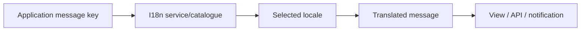
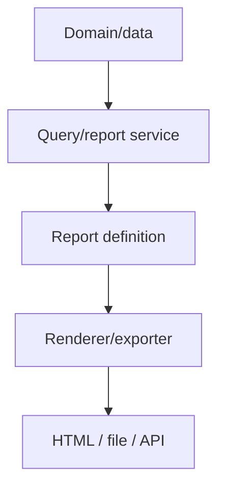
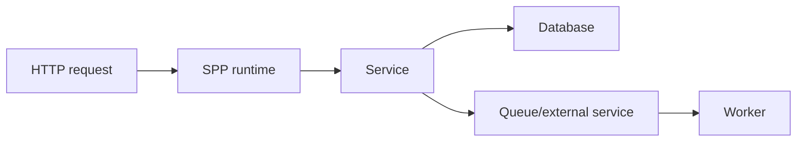

# 69 — Internationalization, Reporting, and Observability

These capabilities are often grouped under “presentation” or “operations,” but they answer different questions. Keep them separate.

| Capability | Question |
|---|---|
| i18n | How should content/messages adapt to language and locale? |
| Reporting | What structured information should the application present for analysis? |
| Logging | What happened during execution? |
| Audit | Who performed which sensitive action? |
| Metrics | How often/how much/how long? |
| Tracing | How did one operation move through boundaries? |
| Diagnostics | Why is something failing? |

## 69.1 Internationalization is an application concern

A multilingual application must distinguish at least:

```text
locale
language
translation message
formatting rules
user/content preference
```

Do not scatter literal translated strings throughout controllers and services.

A useful architecture is:



The exact SPP language/i18n APIs should follow the current repository implementation.

## 69.2 Locale is not authentication state

A locale can be selected from the request, user preference, application default, or other configuration. It should not be treated as proof of identity or trusted authorization state.

Keep:

```text
identity/security
```

separate from:

```text
presentation locale
```

## 69.3 Build i18n into Task Desk

Add messages such as:

```text
Task created
Task updated
Task cannot be empty
Task approved
```

Represent them using stable message keys rather than hard-coded English text.

Then exercise at least two locales and verify that validation errors, page titles, API-visible human messages, and notifications use the intended locale boundary.

## 69.4 Test i18n with Parikshak

Test:

```text
supported locale → expected translation
unknown locale → fallback behavior
missing translation → configured fallback
formatted value → locale-aware representation
```

Do not assume a fallback language or locale precedence without checking the current implementation.

## 69.5 Reporting is not logging

A report is a **deliberately structured view of application information**.

A log is an **execution record**.

For example:

```text
Report:
“Tasks by department for September”

Log:
“TaskReportService took 210 ms”
```

They can share data sources while serving different operational purposes.

## 69.6 Report architecture



The current SPP reporting implementation should be treated as the source of truth for the supported report formats and exporters.

## 69.7 Reporting and persistence

Reports often execute read-heavy queries. Keep reporting queries separate from write-focused business operations where appropriate.

For larger reports, consider whether they should run as background jobs rather than inside an interactive request.

The choice should be based on actual query cost and user experience—not merely on the availability of a queue.

## 69.8 Reporting and security

A report can expose more data than the page from which it was launched.

Therefore:

```text
request identity
 → authorization
 → report scope/filter policy
 → query
 → output
```

A CSV export needs the same authorization discipline as an HTML table.

## 69.9 Logging

Logging answers:

> What happened during execution?

Useful dimensions include:

```text
severity
message
context
application
operation
exception
```

Do not put secrets, tokens, passwords, or unnecessary personal data into logs merely because logging is convenient.

## 69.10 Audit

Audit answers a narrower governance question:

> Who performed which important action, on what object, and when?

A useful audit record might include:

```text
actor
operation
resource
previous state
new state
timestamp
request/correlation identifier where available
```

Audit storage and ordinary diagnostic logging can share infrastructure but should remain conceptually separate.

## 69.11 Metrics

Metrics answer aggregate questions:

```text
How many requests?
How many failures?
How long did operations take?
How many queue jobs failed?
```

A metric is not the same as an individual log message.

## 69.12 Tracing

Tracing follows a single operation through multiple boundaries.



Where the concrete installation supports OpenTelemetry or another trace protocol, use the actual instrumented boundaries. Do not claim universal propagation if the source does not establish it.

## 69.13 Diagnostics as a cross-cutting capability

Diagnostics combines logs, exceptions, timing, state, and source tracing.

For a failing report request, for example:

```text
request
 → auth
 → report authorization
 → report query
 → exporter
 → response
```

The operator should be able to identify the first failing boundary.

## 69.14 Task Desk operational dashboard

Create a small report showing:

```text
open tasks
completed today
average completion time
failed jobs
recent audited actions
```

Keep the report read-only. Then create a separate diagnostic event/log path for report execution.

This demonstrates why report output and execution observability are different products built around the same domain.

## 69.15 Testing observability

Observability should be testable at the contract level.

Examples:

```text
important event produces audit record
exception produces expected diagnostic record
job failure is visible to operator-facing diagnostics
report execution records duration where instrumentation exists
```

Parikshak should verify observable contracts rather than asserting internal implementation details that are free to change.

## 69.16 Deliberate failure lab

Break one boundary at a time:

1. remove a translation key;
2. deny report authorization;
3. force a report query failure;
4. force a queue job failure;
5. throw an exception inside a service;
6. make an external call time out.

Then identify which evidence surface should reveal the problem:

```text
i18n fallback
report error
log
 audit
metric
trace
exception page
```

## 69.17 Coming from other frameworks

### Laravel

Localization, logging, queues, notifications, and reporting are separate concerns even when exposed through a single application facade.

### Symfony

The logging/event/message ecosystem provides useful comparisons; exact services differ.

### Django

Translation, logging, management commands, and asynchronous workers have similar conceptual boundaries.

### React/Vue frontend-only systems

A browser runtime can expose user-facing telemetry, but server-side logs/audit and browser-visible state remain different trust domains.

## Kernel Hacker note

Trace an operational incident from the symptom back through:

```text
browser/client
 → HTTP/API/live entry
 → application/service
 → data/external dependency
 → event/background path
```

Then identify which evidence surface proves each step.

That is observability engineering—not merely “adding logs.”
