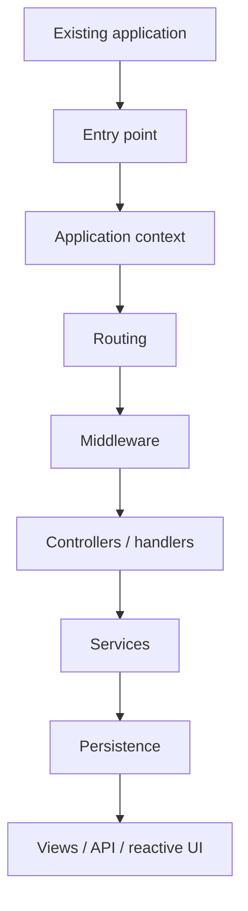
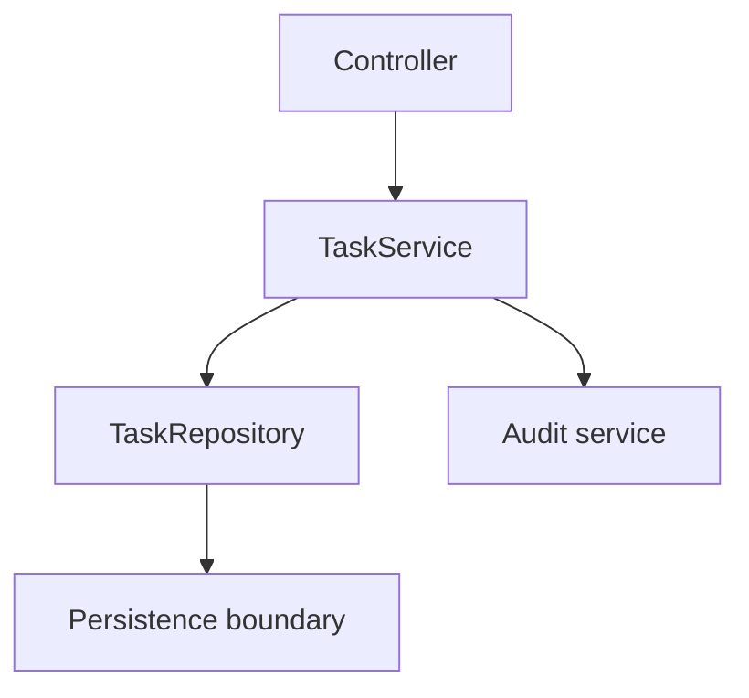
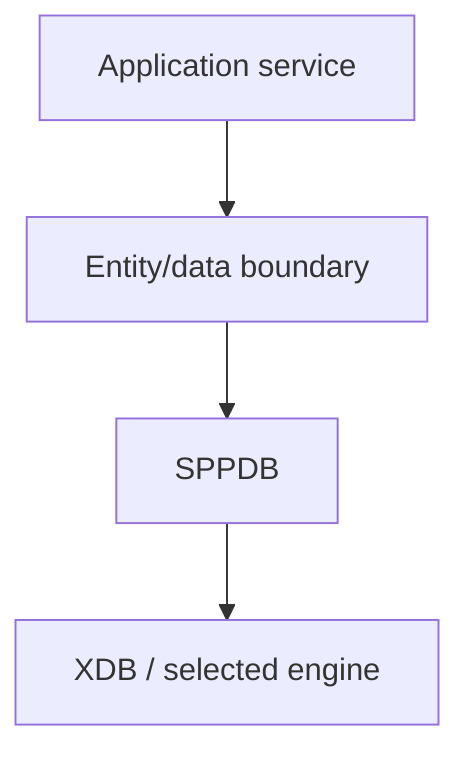
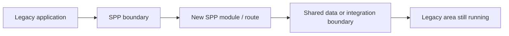

# 70. Porting to SPP from Other Frameworks

A developer coming from Laravel, Symfony, Django, Rails, Spring, ASP.NET, Express/Nest, or another framework should **not** begin by translating class names one-for-one.

The fastest migration path is to translate the **architectural responsibilities** first, then map those responsibilities onto SPP.

This chapter is a practical migration guide rather than a dictionary of equivalent class names.

---

## 70.1 The migration rule

Use this order:

```text
Existing application
      ↓
Identify responsibilities
      ↓
Identify framework concepts already being used
      ↓
Map concepts to SPP mechanisms
      ↓
Keep business rules stable
      ↓
Replace framework infrastructure incrementally
      ↓
Test with Parikshak
      ↓
Move one boundary at a time
```

Do not attempt a mechanical rewrite of an entire project in one pass.

A good migration preserves observable application behavior while changing the framework infrastructure underneath it.

---

## 70.2 First understand the SPP mental model

Before translating an existing framework, learn these SPP concepts:

| SPP concept | What it means | Migration question |
|---|---|---|
| Application context | Named application runtime | What is the equivalent of a Django app / Rails app / ASP.NET application boundary? |
| Scheduler | Selects the active application context | How does the old framework decide which application/tenant/site receives a request? |
| Registry / App container | Runtime object/service resolution | Where does the old framework construct and inject services? |
| Middleware Pipeline | Request pre/post-processing | Where do filters, middleware, interceptors, guards, or HTTP middleware live today? |
| Routing paradigms | Maps requests to application behavior | Is the old application controller-routed, page/config-routed, API-routed, or mixed? |
| Events | Decoupled runtime extension points | Which signals/listeners/subscribers exist today? |
| Modules | Framework feature packaging | Which bundles/packages/apps/plugins are really application features? |
| SPPView / BladeOne / Drishyam | Rendering stack | Which templates and rendering contracts need to be preserved? |
| SPPDB / XDB | Persistence architecture | Which ORM/repository/database boundaries should remain stable? |
| Parikshak | Testing framework | Which tests become the migration safety net? |
| LiveComponent / SPP Live / SPPUX | Reactive UI layers | Which existing SPA/AJAX/live features should become server-reactive, browser-reactive, or remain ordinary HTTP? |
| Queue / Cron | Background execution | Which jobs, scheduled tasks, and workers move out of synchronous requests? |
| Polyglot / IPC | External runtime integration | Which existing services should remain outside PHP? |

The point is to migrate **responsibility**, not syntax.

---

# Part I — Porting the architecture

## 70.3 Start with a framework-neutral inventory

Before touching source code, inventory the existing application.

Create a table such as:

| Existing concern | Current implementation | Keep as business logic? | SPP destination |
|---|---|---:|---|
| URL dispatch | Existing router | Yes | SPP routing paradigm |
| authentication | Existing guard/filter | Mostly | SPPAuth/security |
| database | ORM/repositories | Yes | SPPDB/entity/XDB boundary |
| templates | Blade/Twig/etc. | Often partly | SPPView / extended BladeOne / Drishyam |
| background jobs | Queue system | Yes | SPPQueue or external worker architecture |
| scheduled tasks | Cron | Yes | SPP Cron/Scheduler integration |
| domain events | Existing event bus | Yes | SPP events where appropriate |
| tests | Existing test suite | Yes | Preserve behavior, port selectively to Parikshak |

This inventory becomes the migration plan.

---

## 70.4 Migrate the outside before the inside

A useful order is:



Migrate the outer runtime first while keeping business services stable.

For example, do **not** rewrite the business layer merely because the old framework has a different controller base class.

---

# Part II — Laravel

## 70.5 Laravel developers: mental translation

Laravel developers already know many concepts that exist in SPP.

| Laravel | SPP migration target |
|---|---|
| Application/service container | App container + Registry |
| Middleware | MiddlewareInterface + Pipeline + MiddlewareKernel |
| Events/listeners | SPPEvent + EventHandler + `#[On]` |
| Service providers / bootstrapping | SPP application/module/bootstrap mechanisms |
| Routes | Attribute routes, `pages.yml`, API/page routing, CLI-generated routes |
| Controllers | Request-facing handlers/controllers in the SPP application structure |
| Blade | SPPView + extended BladeOne integration |
| Eloquent | SPP entity/data abstractions and SPPDB/XDB |
| Artisan | SPP CLI and interactive command mode |
| Laravel jobs/queues | SPPQueue / worker architecture |
| Scheduler | SPP Scheduler/Cron facilities |
| Laravel tests/PHPUnit | Parikshak for SPP-aware testing |
| Livewire | LiveComponent |
| Alpine/Vue/React | SPPUX or external frontend, depending on the boundary |

Do not assume API compatibility. This table is an architectural translation guide.

### Recommended Laravel migration sequence

1. Preserve the domain/service layer.
2. Introduce an SPP application context.
3. Port request entry points and routing.
4. Port middleware.
5. Port service resolution.
6. Port persistence boundaries.
7. Port views.
8. Port authentication/security.
9. Port tests to Parikshak where framework-aware behavior must be tested.
10. Port reactive surfaces last.

### Laravel-specific trap

Do not replace every Laravel service provider with a giant SPP bootstrap file.

In SPP, decide whether the behavior belongs in:

- application bootstrap;
- a module;
- a service;
- configuration;
- middleware; or
- an event handler.

The same business capability may have a cleaner SPP home than a literal service-provider translation.

---

# Part III — Symfony

## 70.6 Symfony developers

Symfony developers will recognize dependency injection, middleware-like HTTP processing, event dispatch, controllers, routing, configuration, console commands, and template engines.

Useful conceptual mappings include:

| Symfony | SPP |
|---|---|
| HttpKernel request lifecycle | SPP application bootstrap + MiddlewareKernel + dispatch path |
| EventDispatcher | SPPEvent |
| EventSubscriber | EventHandler / `#[On]` listener patterns |
| DependencyInjection component | SPP App container / Registry |
| Routing component | SPP routing paradigms |
| Twig | SPPView / BladeOne / Drishyam, depending on the application |
| Console | SPP CLI |
| Messenger | SPPQueue or explicit external worker architecture |
| Bundles | SPP modules |

### Symfony migration principle

Think of a Symfony Bundle as an architectural prompt, not a file-layout template.

Ask:

> Is this feature a reusable SPP module, an application-local module, an ordinary service, or a configuration concern?

That choice matters more than preserving the Bundle directory structure.

---

# Part IV — Django

## 70.7 Django developers

Django developers will notice that SPP can support controller/page-oriented routing, rendering, entities/data, middleware, forms, authentication, management commands, and application boundaries, but the terminology differs.

A useful translation is:

| Django | SPP concept |
|---|---|
| Project | SPP runtime/project installation |
| App | SPP application/module boundary, depending on the feature |
| URLconf | `pages.yml` or route attributes / route configuration |
| Middleware | Middleware Pipeline |
| View function/class | Controller/page/request handler |
| Template | SPPView / BladeOne / Drishyam template |
| Model | Entity/data layer |
| Signals | SPP events, when decoupled notification is appropriate |
| Management command | SPP CLI command |
| Celery | SPPQueue/external worker architecture |

### Important difference

Do not automatically translate every Django signal into an SPP event.

First ask whether the relationship is truly decoupled. If service A directly requires service B's result, a direct service call is usually clearer.

---

# Part V — Rails

## 70.8 Rails developers

Rails developers can use the following mental translations:

| Rails | SPP |
|---|---|
| routes.rb | `pages.yml`, route attributes, API/page routing |
| controller | SPP controller/handler |
| model | Entity/data layer |
| ActiveRecord | SPPDB/entity/XDB architecture |
| before_action | Middleware or route-level middleware, depending on scope |
| callbacks | Events/observers where appropriate |
| ActiveJob | Queue/worker architecture |
| rake tasks | SPP CLI commands |
| views/ERB | SPPView/BladeOne/Drishyam |
| engines | SPP modules |

### Rails migration warning

Rails encourages a very convention-heavy application structure.

SPP offers conventions, but it also provides multiple architectural paradigms. Do not create unnecessary compatibility layers merely to preserve Rails naming when SPP already has a better native boundary.

---

# Part VI — Spring / Spring Boot

## 70.9 Spring developers

Spring developers already understand inversion of control, dependency injection, services, repositories, events, filters/interceptors, scheduled jobs, and modular applications.

| Spring | SPP |
|---|---|
| ApplicationContext | SPP application context + App object |
| Bean container | SPP App container / Registry |
| Filter | Middleware |
| Interceptor | Middleware or route-level middleware, depending on concern |
| ApplicationEvent | SPPEvent |
| `@EventListener` | `#[On]` and event registration mechanisms |
| `@Scheduled` | Cron/Scheduler mechanisms |
| `@Controller` | Controller/request-facing handlers |
| Thymeleaf | SPPView/BladeOne/Drishyam, depending on renderer |
| Spring Data | SPP entity/data abstractions |
| Spring Batch / async execution | Queue/workflow/background architecture |

### Spring migration principle

Do not recreate Spring's bean lifecycle semantics in PHP merely because the old system used them.

Translate the requirement:

> “This service must be available through dependency resolution.”

That is a better migration statement than:

> “I need an equivalent of every BeanPostProcessor.”

---

# Part VII — ASP.NET Core

## 70.10 ASP.NET Core developers

| ASP.NET Core | SPP |
|---|---|
| DI container | App container / Registry |
| Middleware | Middleware Pipeline |
| Endpoint routing | SPP routing paradigms |
| Filters | Middleware / route-level mechanisms |
| Controllers | Controllers/handlers |
| Razor | SPPView/rendering stack |
| Hosted services | Queue/workers/background execution |
| `IHostedService` | Long-running worker architecture where appropriate |
| Configuration | SPPConfig/settings/configuration files |
| `appsettings` | SPP configuration and settings layers |
| SignalR | SPP Live or another explicitly selected transport architecture, depending on requirements |
| xUnit/NUnit tests | Parikshak where SPP-aware testing is required |

### Important difference

ASP.NET Core's middleware model is a powerful analogy for SPP Middleware, but do not assume the exact delegate signatures or lifecycle are interchangeable. Use the SPP contract documented by the repository.

---

# Part VIII — Node.js / Express / NestJS

## 70.11 Node/Express developers

Express developers will find the middleware model immediately familiar, but the rest of SPP is broader.

| Express/Nest | SPP |
|---|---|
| middleware | Middleware |
| router | SPP routing |
| controller | SPP handler/controller |
| provider/service | SPP service + DI |
| events | SPPEvent |
| modules (Nest) | SPP modules, but with different lifecycle/manifest rules |
| CLI | SPP CLI |
| queue worker | SPPQueue / external worker |
| SPA frontend | SPPUX or external frontend |

A key migration task is deciding which browser-side logic should remain an independent SPA and which interactions should become LiveComponent/SPPUX features.

---

# Part IX — Porting MVC applications

## 70.12 Keep the domain stable

The migration should ideally preserve:

```text
entities
business rules
invariants
use cases
integration contracts
```

Change these only when the new SPP architecture deliberately improves the design.

### Example

Old framework:

```text
Controller
  ↓
Service
  ↓
Repository
  ↓
Database
```

SPP:

```text
Route / page / API
  ↓
Middleware
  ↓
Controller / handler
  ↓
SPP service
  ↓
Entity / data boundary
  ↓
SPPDB / XDB
```

The business flow remains recognizable.

---

# Part X — Porting routes and pages

SPP has multiple routing paradigms, so route migration requires a choice.

## Option A — Central page configuration

Use `pages.yml` when the existing application is strongly page/configuration oriented.

This is often a good migration path for older PHP/page-centric systems because the route/page definition can remain declarative.

## Option B — Attribute routes

Use route attributes when the application is controller-oriented and the team wants route declaration near the implementation.

## Option C — CLI/scaffold-generated routes

Use SPP's CLI generation mechanisms when creating new route/page structures during the migration.

The CLI is a creation mechanism; the runtime still resolves the resulting route/page definition.

## Option D — API routing

Port headless endpoints through the SPP API infrastructure rather than pretending every API endpoint is an HTML page.

## Option E — Live/reactive endpoints

Only convert an interaction to LiveComponent/SPP Live when there is a real interactive-state benefit.

Do not migrate every AJAX call merely because SPP offers a live architecture.

---

# Part XI — Porting middleware, filters, guards, and interceptors

Create a responsibility map first:

| Existing mechanism | SPP target |
|---|---|
| Authentication filter | Auth middleware/security |
| CSRF filter | CSRF middleware |
| Rate limiter | Rate-limit/throttle middleware |
| Request logger | Request logging middleware |
| Security headers | Security headers middleware |
| Controller-specific guard | Route/controller middleware |
| Global response processing | Global middleware |
| Domain reaction | Event, not middleware |

The most common migration mistake is putting domain behavior into middleware because the old framework allowed a convenient filter hook.

Ask whether the behavior is:

- request infrastructure;
- authorization;
- domain logic; or
- a decoupled application reaction.

Then choose middleware, service, or event accordingly.

---

# Part XII — Porting events and hooks

Build a hook inventory.

```text
before request
request accepted
after request
entity created
entity updated
workflow transition
report generated
file transferred
content promoted
```

Then classify each:

```text
Request lifecycle hook → middleware/event
Domain event          → SPPEvent
Mandatory collaborator → direct service call
Persistence lifecycle → observer/event where supported
UI-local interaction  → component/client event
```

This prevents the old framework's event vocabulary from being copied into inappropriate SPP layers.

---

# Part XIII — Porting dependency injection

Do not start by reproducing container configuration line-for-line.

Start with the dependency graph:



Then decide which dependencies should be:

- constructed normally;
- resolved from the application container;
- singletons/application-scoped;
- module-provided;
- or external adapters.

The repository documents application-level `make()`, `singleton()`, and `call()` patterns. Use those native contracts instead of recreating another framework's container semantics.

---

# Part XIV — Porting templates and views

Keep template intent stable first:

```text
page structure
forms
partials/components
layout
assets
messages
```

Then choose the SPP rendering path.

For Blade-based applications, the migration may be relatively direct because SPP includes an extended BladeOne layer.

But validate framework-specific directives and helpers individually.

Do not assume every directive from another Blade implementation behaves identically.

For Twig or another template system, first translate the data contract and view responsibilities, then choose the SPP renderer instead of mechanically rewriting every template token.

---

# Part XV — Porting data access

Keep the repository/service boundary if it already represents a clean domain boundary.

Then decide which SPP layer should back it:



Do not rewrite every database query merely because a different ORM is available.

Migrate in this order:

1. schema compatibility;
2. entity/domain mapping;
3. read paths;
4. write paths;
5. transactions/locking where actually required;
6. migrations/seeders;
7. performance-sensitive indexes;
8. test isolation.

---

# Part XVI — Porting authentication and security

Separate these concerns during migration:

```text
identity
↓
authentication
↓
authorization
↓
CSRF
↓
input sanitization
↓
rate limiting
↓
security headers
↓
audit/observability
```

Do not replace all of them with a single “security module” checkbox.

A migration should prove each security property independently.

For each existing security rule, record:

```text
old rule
new SPP mechanism
test proving behavior
failure case
production configuration
```

---

# Part XVII — Porting tests

Tests are the migration safety net.

A recommended order is:

```text
existing characterization tests
          ↓
unit tests for business rules
          ↓
SPP application tests
          ↓
middleware/event tests
          ↓
data tests
          ↓
API tests
          ↓
workflow tests
          ↓
LiveComponent tests
          ↓
end-to-end/capstone tests
```

Do not delete the old test suite merely because a new framework is being introduced.

Port behavior first.

Then improve test structure as the new architecture becomes stable.

Parikshak should become part of the migration toolchain wherever SPP-specific runtime behavior needs to be tested.

---

# Part XVIII — Porting background work

Classify existing background execution:

| Existing pattern | SPP destination |
|---|---|
| Short synchronous operation | Synchronous service call |
| Scheduled maintenance | Cron/Scheduler |
| Queued application work | SPPQueue/worker architecture |
| Long-running external service | External service/process |
| Workflow timeout | Workflow/Cron processing |
| Scheduled reporting | Reporting + scheduler |

Do not put slow migration work back into the HTTP request merely because the new framework can execute PHP there.

---

# Part XIX — Porting frontend architecture

Do not force the entire old frontend into one SPP mechanism.

Choose by interaction type:

```text
Mostly server-rendered pages
        → SPPView

Small server-interactive components
        → LiveComponent

Live transport required
        → SPP Live

Client-side reactive islands
        → SPPUX

Independent SPA
        → keep external frontend and integrate through API
```

This allows gradual migration instead of a frontend rewrite.

---

# Part XX — Incremental strangler migration

A safe migration can look like this:



Move one bounded capability at a time.

For example:

1. reporting;
2. authentication portal;
3. admin pages;
4. workflow;
5. API;
6. reactive support desk;
7. remaining legacy pages.

The old and new systems can coexist while the boundary moves.

---

# Part XXI — Multi-application migration

If the old platform contains multiple sites/tenants/applications, do not immediately collapse them into one SPP application.

First identify the boundaries:

```text
site A
site B
admin
API
worker
content publisher
```

Then decide which should become:

- separate SPP application contexts;
- separate modules;
- external services;
- or one shared application with tenant/context resolution.

SPP's Scheduler/application-context architecture is particularly relevant here.

---

# Part XXII — Polyglot migration

If the old system already has Java, Go, Python, Node, .NET, or other services, **do not rewrite them automatically**.

First classify the integration:

```text
HTTP API
message/queue
IPC
file/content transfer
scheduled batch
shared storage
```

Then determine whether SPP should:

- call the external application;
- host a bridge;
- expose an API;
- use a queue;
- or replace the service entirely.

SPP's polyglot architecture exists to allow non-SPP applications to participate where appropriate.

---

# Part XXIII — Migration stages

A practical project can use these stages:

### Stage 0 — Inventory

Document routes, modules, services, jobs, tables, integrations, templates, security rules, and tests.

### Stage 1 — Characterization

Freeze current behavior with tests.

### Stage 2 — Runtime boundary

Introduce SPP application context and entry-point integration.

### Stage 3 — Request layer

Move routing and middleware.

### Stage 4 — Application services

Move dependency resolution and reusable services.

### Stage 5 — Data boundary

Move entities/data access and migrations.

### Stage 6 — Presentation

Move views/forms/assets.

### Stage 7 — Security

Move identity/authentication/authorization and web security.

### Stage 8 — Operations

Move jobs, Cron, reporting, logging, observability.

### Stage 9 — Reactive features

Move selected interactions to LiveComponent/SPP Live/SPPUX.

### Stage 10 — Enterprise integration

Move polyglot/external applications and multi-application architecture.

### Stage 11 — Remove legacy framework

Only after the migrated behavior is proven.

---

# Part XXIV — Migration checklist

Before declaring a subsystem migrated:

```text
☐ behavior characterized
☐ destination SPP concept chosen intentionally
☐ route/page behavior tested
☐ middleware/security behavior tested
☐ events tested where applicable
☐ persistence verified
☐ configuration migrated
☐ CLI/scaffolding conventions documented
☐ Parikshak coverage added
☐ failure case tested
☐ observability present
☐ rollback/recovery documented
☐ production configuration reviewed
☐ source map recorded
```

---

# Part XXV — Anti-patterns during framework migration

### Mechanical translation

Bad:

> Rename every Laravel/Symfony/Django class to the nearest SPP-looking name.

Better:

> Map responsibilities onto SPP's native architecture.

### Big-bang rewrite

Bad:

> Rewrite routing, data, views, security, and frontend simultaneously.

Better:

> Move bounded capabilities incrementally and protect each step with tests.

### Compatibility forever

Bad:

> Recreate the old framework's architecture inside SPP indefinitely.

Better:

> Use compatibility layers as temporary migration tools and remove them once the SPP-native architecture is stable.

### Over-reactive migration

Bad:

> Turn every page or AJAX action into a live component.

Better:

> Introduce LiveComponent/SPP Live/SPPUX only where interactivity benefits the application.

---

# Part XXVI — Coming to SPP with different expectations

The best migration question is:

> **What architectural problem am I solving?**

Not:

> **What is SPP's exact equivalent of my old framework class?**

That mindset is what lets experienced framework developers take advantage of SPP instead of building a foreign framework inside it.

---

## Final migration project

Take a real application from your current framework and produce a migration dossier containing:

1. architecture inventory;
2. responsibility-to-SPP mapping;
3. route migration plan;
4. middleware/security map;
5. service/DI map;
6. entity/data map;
7. event/hook map;
8. view/frontend migration plan;
9. queue/Cron map;
10. Parikshak migration plan;
11. rollback strategy;
12. production cutover plan.

Then migrate one bounded subsystem completely before starting the next.

That is the recommended SPP migration strategy.
