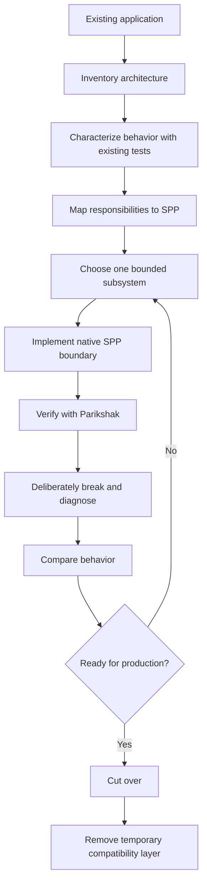

# 70A. Framework Porting Playbooks

This page is the navigation hub for developers migrating existing applications to SPP.

## Migration paths

- [70 — Porting to SPP from Other Frameworks](70-porting-to-spp-from-other-frameworks.md) — comprehensive architecture-first migration guide.
- Use the framework-specific sections in Chapter 70 for Laravel, Symfony, Django, Rails, Spring/Spring Boot, ASP.NET Core, and Node/Express/NestJS.
- [23 — Coming to SPP from Other Frameworks](23-coming-from-other-frameworks.md) — existing comparison/reference material.
- [56 — Plain PHP → Framework → SPP comparison method](56-plain-php-framework-spp-comparison.md) — the methodology used by the migration guide.
- [67 — SPP Architecture Anti-Patterns and Common Mistakes](67-architecture-antipatterns-and-mistakes.md) — avoid reproducing the old framework's architecture inside SPP.
- [68 — How to Read the SPP Source](68-reading-the-spp-source.md) — verify native SPP behavior while porting.

## Recommended migration process



## What not to do

Do not treat porting as:

```text
old class name → similar SPP class name
old directory → similar SPP directory
old command → similar SPP command
old event → similar SPP event
```

Instead treat porting as:

```text
old responsibility
    ↓
SPP architectural concept
    ↓
SPP native implementation
```

## Exit criteria

A subsystem is considered migrated only when:

- its behavior is characterized;
- the SPP responsibility mapping is documented;
- production code uses the chosen SPP boundary;
- tests prove the important behavior;
- failure/recovery behavior is understood;
- temporary compatibility code is identified;
- a rollback plan exists; and
- the source map is recorded for future maintenance.
