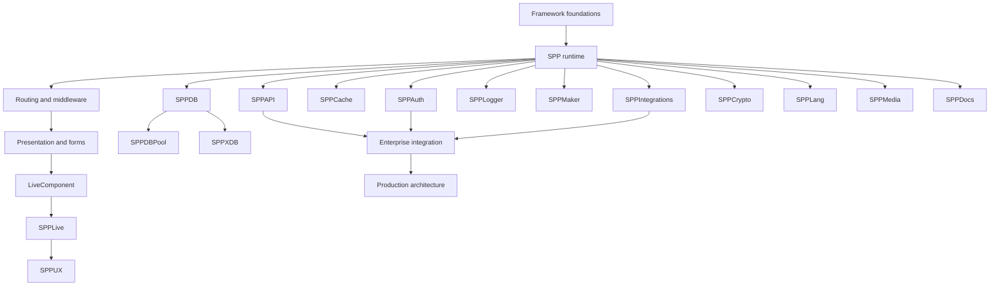

# 73 — Current Platform Modules Learning Map

The September 2026 source rescan shows that SPP's first-party platform surface is broader than the original beginner curriculum. This chapter maps the newly prominent modules into the existing learning journey.

## 1. SPPAPI

Current source evidence includes dedicated `Controllers`, `Dispatchers`, `OpenAPI`, and `Subscribers` areas plus API documentation, live-action, AJAX, resource, response, paginator, and route-model-binding classes.

### Teach it as

```text
HTTP/API request
    ↓
SPP API dispatch
    ↓
controller/action
    ↓
resource/response
    ↓
pagination/model binding where required
    ↓
OpenAPI/documentation and tests
```

The handbook should not reduce SPPAPI to “return JSON from a controller.” API dispatch, representation, validation/security boundaries, documentation, and testing are separate concerns.

## 2. SPPAuth

The current source contains authentication and identity infrastructure extending beyond a basic username/password example. Notable source surfaces include anonymous users, audit logging, field policies, guard contracts, magic links, MFA, OAuth server support, policy registry, rate limiting, RBAC, SCIM handling, the main authentication facade, and groups.

### Teach it as

```text
Authentication
    ↓
Identity / guard
    ↓
Groups / roles / rights
    ↓
Policy evaluation / field policy
    ↓
MFA / magic link / OAuth / SCIM
    ↓
Rate limiting + audit logging
```

Always distinguish authentication, authorization, identity lifecycle, and security operations.

## 3. SPPCache

The current module contains a cache manager, command support, module initialization, configuration metadata, and a source tree.

The handbook should add a dedicated cache lesson covering key/value lifecycle, invalidation, backend abstraction where implemented, operational commands, and interaction with persistence.

## 4. SPPCrypto

The current module contains `Vault`, `MpcKeySharder`, and command support.

This deserves a security-oriented lesson that distinguishes encryption from secret management and key-management architecture. Do not infer cryptographic guarantees from class names alone; document algorithms, storage, rotation, and failure semantics only when verified in source/tests.

## 5. SPPDBPool

The current source tree contains a distinct `sppdbpool` module alongside `sppdb`.

The handbook should therefore teach pooling as a separate concern:

```text
Application
  ↓
SPPDB abstraction
  ↓
driver/connection layer
  ↓
pooling infrastructure when configured
  ↓
database
```

Do not imply that every SPPDB operation automatically uses a pool.

## 6. SPPEnv

Environment handling is represented as a first-party module. It should be connected to the configuration chapter so beginners understand the difference between:

- source-controlled configuration;
- environment-specific values;
- secrets;
- runtime-derived configuration; and
- application-context configuration.

## 7. SPPIntegrations

Integration infrastructure deserves its own boundary-oriented lesson. Teach external services as explicit integration points rather than pretending every external dependency is part of the local SPP runtime.

## 8. SPPLang

Language/internationalization support should be a specialized branch. Teach translation resources, translation lookup, translatable data, locale selection, and import/export only where current source supports the specific behavior.

## 9. SPPLive

Keep the existing layered model:

```text
LiveComponent
    ↓
SPP Live
    ↓
transport/engine
    ↓
SPPUX/browser runtime
```

The current source must be rechecked whenever transport engines or handlers change.

## 10. SPPLogger

Logging is more than printing errors. The first-party logger should be taught as a runtime/operations concern alongside diagnostics, audit logging, workers, and production deployment.

## 11. SPPMaker

SPPMaker belongs in the developer-tooling/meta-programming branch. Teach the difference between:

- a framework feature used by an application; and
- a framework tool that generates application artifacts.

A generated artifact becomes ordinary application code after generation; the generator itself has a different lifecycle.

## 12. SPPMedia

Media/file handling should be a dedicated specialized branch when applications manage uploads, assets, transformations, metadata, or media storage. It should connect to the broader storage and security lessons.

## 13. SPPDocs

The current generated documentation exposes the `SppDocs` namespace and classes including `SPPDocGenerator` and `SPPRouteDocCollector`.

This belongs in framework tooling/reference material. It is **not** a tutorial on hosting the SPP handbook website.

The conceptual pipeline is:

```text
SPP source / routes / API metadata
          ↓
SppDocs collectors
          ↓
documentation generation
          ↓
reference artifacts
```

The exact collector/generator behavior must be kept synchronized with the source.

## 14. SPPXDB

The repository's generated documentation exposes a substantial SPPXDB namespace, including engines and classes associated with Raft-related functionality, ACL, locking, validation, queries, observers, controllers, and the XDB facade.

The XDB curriculum therefore needs to remain a dedicated branch rather than being treated as a few CRUD helper methods inside the generic database chapter.

## 15. Curriculum rebalancing

The updated learning graph is:



## 16. Documentation policy

A new module should trigger one of three actions:

1. **Update an existing chapter** when it extends an existing responsibility.
2. **Create a specialized branch** when it represents a distinct developer responsibility.
3. **Create reference-only documentation** when it is highly application-specific or contributed.

This prevents both under-documentation and an unreadable “one chapter per PHP directory” handbook.
