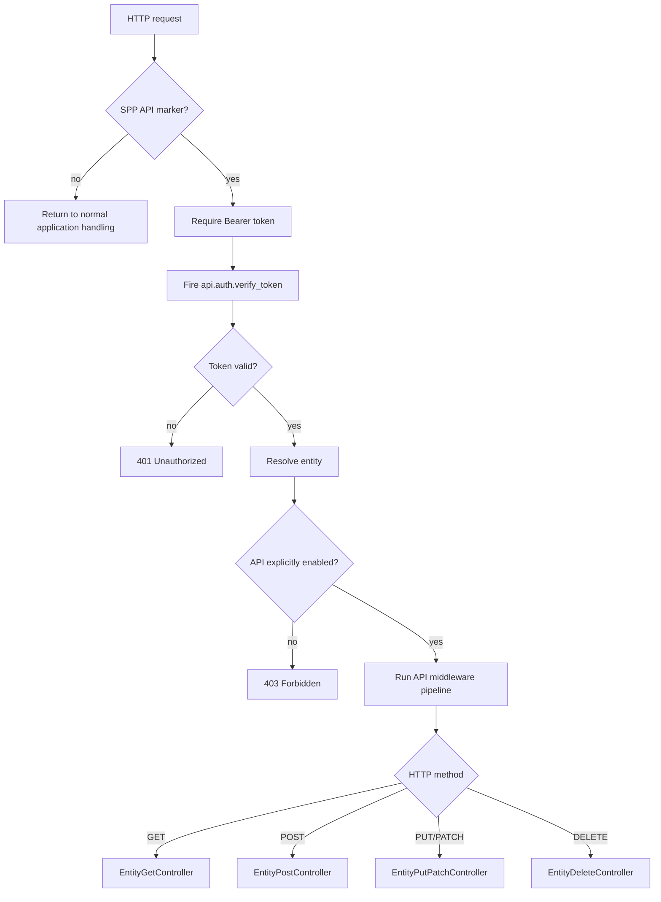

# 74. SPPAPI: Building and Exposing HTTP APIs

> Evidence level: **Implemented** where this chapter describes the current `sppapi` source; examples that depend on application-specific entities are **Guidance**.

## 74.1 What SPPAPI is

SPPAPI is the framework's entity-oriented HTTP API layer. The current implementation is deliberately defensive: an API request must first be recognized as an SPP API request, authenticated with a Bearer token, resolved to an entity class, and explicitly permitted for API exposure.

The current source lives under `spp/modules/spp/sppapi/` and includes controllers, dispatchers, OpenAPI-related code, subscribers, AJAX/live-action support, responses, pagination, and route-model binding.

## 74.2 Request lifecycle

The current `SPPAPI::handle()` implementation recognizes `?__api=1` or `X-SPP-API: 1`, requires a Bearer token, fires `api.auth.verify_token`, resolves an entity, checks `enable_api`, and dispatches GET/POST/PUT/PATCH/DELETE through the API pipeline. fileciteturn431file0L2-L2

## 74.3 Entity resolution

Resolution supports several paths:

1. A class name may already be supplied.
2. Otherwise SPP tries the active application context's `App\\<Context>\\Entities\\<Entity>` convention.
3. If a configured entity exists without a dedicated PHP class, the generic entity implementation can be used.
4. An invalid entity class is rejected.

This is important architecturally: SPPAPI is not merely a thin JSON wrapper around arbitrary PHP classes. The API layer deliberately connects HTTP exposure to SPP's entity metadata and application context.

## 74.4 Explicit API exposure

An entity must have API exposure enabled through its metadata. The current implementation rejects an entity with HTTP 403 when that metadata is not enabled. fileciteturn431file0L2-L2

That gives a useful security rule for application design:

> **Persisted does not automatically mean externally exposed.**

Treat `enable_api` as an explicit boundary decision, not a convenience switch.

## 74.5 Authentication and events

The API implementation extracts the Bearer token and sends it through the event `api.auth.verify_token` with an `is_valid` flag. A registered listener is responsible for establishing whether the token is valid. If no valid token is established, the request is rejected. fileciteturn431file0L2-L2

The implementation also exposes `setAuthValidator()` / `checkAuth()` for a callable validator, while the request path itself uses the token-verification event. Keep these mechanisms conceptually separate when teaching the system: one is a callable authentication hook; the request handler's current token flow is event-driven.

## 74.6 HTTP methods

The implemented dispatcher maps methods as follows:

| Method | Current controller responsibility |
|---|---|
| GET | `EntityGetController` |
| POST | `EntityPostController` |
| PUT/PATCH | `EntityPutPatchController` |
| DELETE | `EntityDeleteController` |
| Other | 405 response |

The method mapping is visible in the current `SPPAPI::handle()` source. fileciteturn431file0L2-L2

## 74.7 API documentation

The special entity value `docs` routes to `ApiDocController::render()`. The source tree also contains an `OpenAPI` area, so API documentation should be taught as part of the API subsystem rather than as an unrelated documentation feature. fileciteturn430file0L2-L2

## 74.8 Error semantics

The current handler distinguishes several boundary failures:

- `400` — missing API parameter or invalid entity class.
- `401` — missing/invalid Bearer authentication.
- `403` — API exposure is not enabled.
- `404` — entity cannot be found.
- `405` — unsupported HTTP method.
- `500` — unexpected internal exception.

These are source-derived behaviors, not a claim that every application-level controller returns exactly the same payload.

## 74.9 Teaching exercise

Build an entity API in this order:

1. Define an entity.
2. Keep API exposure disabled and observe the boundary.
3. Enable API exposure deliberately.
4. Register token verification.
5. Test GET.
6. Add POST and PUT/PATCH.
7. Test DELETE only after understanding authorization and destructive-operation controls.
8. Inspect generated API documentation.

The lesson is not merely how to make an endpoint respond; it is how SPP connects **entity metadata → authentication → middleware → controller → response**.

## 74.10 Source anchors

- `spp/modules/spp/sppapi/class.sppapi.php`
- `spp/modules/spp/sppapi/class.sppapiresource.php`
- `spp/modules/spp/sppapi/class.sppapiresponse.php`
- `spp/modules/spp/sppapi/class.spppaginator.php`
- `spp/modules/spp/sppapi/class.spproutemodelbinding.php`
- `spp/modules/spp/sppapi/Controllers/`
- `spp/modules/spp/sppapi/Dispatchers/`
- `spp/modules/spp/sppapi/OpenAPI/`
- `spp/modules/spp/sppapi/Subscribers/`
