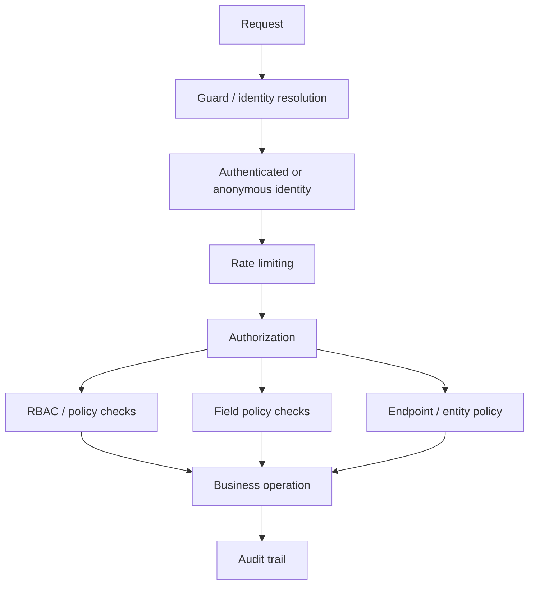

# 75. SPPAuth: Authentication, Authorization, Identity and Security Policy

> Evidence level: **Implemented** for the current module inventory; individual deployment choices are **Guidance**.

## 75.1 Why authentication is a platform concern

Authentication answers **who is making a request**. Authorization answers **what that identity may do**. Audit answers **what happened and why it matters later**. SPPAuth brings these concerns together rather than treating login as a page-level feature.

The current first-party module includes guards, anonymous-user handling, audit logging, field policies, magic links, MFA, OAuth server support, rate limiting, RBAC, SCIM handling, groups, and policy registration.

## 75.2 Security layers

This diagram is a teaching model: the exact ordering can be application- and middleware-dependent. Do not read it as a claim that every SPP request passes through every SPPAuth class.

## 75.3 Identity primitives

The module's `GuardInterface`, `class.webguard.php`, and `AnonymousUser.php` establish the conceptual boundary between request handling and identity. A useful application architecture keeps identity resolution near the request boundary and keeps business authorization in policies/services rather than scattering checks throughout templates.

## 75.4 RBAC and policy

RBAC is useful when permissions naturally map to roles and groups. Policy objects become more expressive when access depends on the subject, target resource, fields, tenant, ownership, workflow state, or contextual conditions.

SPPAuth includes both `RBAC.php` and `PolicyRegistry.php`, plus `FieldPolicy.php`. That combination should be taught as a layered authorization model:

| Layer | Question |
|---|---|
| Identity | Who are you? |
| Role/group | Which coarse capabilities do you have? |
| Resource policy | May you perform this operation on this resource? |
| Field policy | Which attributes may you read/write? |
| Rate limit | How frequently may you attempt this operation? |
| Audit | What security-relevant action occurred? |

## 75.5 Strong authentication options

The current module contains `MFA.php`, `MagicLink.php`, and `OAuthServer.php`. These should not be presented as interchangeable login recipes. They solve different identity and trust problems:

- **MFA** strengthens an existing authentication flow.
- **Magic links** provide passwordless authentication through possession of a controlled communication channel.
- **OAuth server functionality** addresses delegated authorization/token-based integration.

The handbook should always distinguish implemented capability from a recommended production configuration.

## 75.6 Provisioning and enterprise identity

`SCIMHandler.php` indicates support for an enterprise provisioning boundary. In an enterprise deployment, identity lifecycle is broader than login: users and groups may be created, updated, deactivated, or synchronized from an identity provider.

Treat provisioning as a lifecycle integration, not as a second login system.

## 75.7 Rate limiting

`RateLimit.php` belongs in the security boundary because abuse control is distinct from authentication. A correctly authenticated principal can still be abusive. Rate limiting should therefore be designed around the protected resource and threat model rather than simply around IP addresses.

## 75.8 Auditability

`AuditLog.php` provides the source-level anchor for security/audit teaching. Audit records should answer at least: **who**, **what**, **when**, **target**, and, where applicable, **result/context**. Do not claim that the module automatically makes an application compliant with a particular regulation; compliance depends on configuration, retention, controls, operational processes, and jurisdiction.

## 75.9 Security design exercise

For a `StudentRecord` entity, design:

1. anonymous access rules;
2. authenticated read access;
3. role-based administrative access;
4. field-level restrictions for sensitive fields;
5. rate limits for repeated API operations;
6. audit events for changes;
7. MFA requirements for privileged users.

Then map each requirement to the appropriate SPPAuth layer. This teaches separation of concerns better than implementing one large `if ($user->isAdmin())` condition.

## 75.10 Source anchors

Current module evidence includes:

- `spp/modules/spp/sppauth/AnonymousUser.php`
- `AuditLog.php`
- `FieldPolicy.php`
- `GuardInterface.php`
- `MagicLink.php`
- `MFA.php`
- `OAuthServer.php`
- `PolicyRegistry.php`
- `RateLimit.php`
- `RBAC.php`
- `SCIMHandler.php`
- `class.sppauth.php`
- `class.sppauth.groups.php`
- `class.webguard.php`
