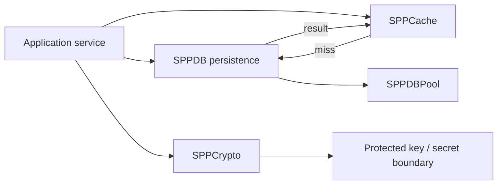

# 76. Data Services: SPPDB, SPPDBPool, SPPCache and SPPCrypto

> Evidence level: **Implemented** for module presence and boundaries; exact deployment configuration is **Guidance**.

This chapter groups closely related infrastructure services while keeping their responsibilities distinct.

## 76.1 The four boundaries

| Module | Primary responsibility | Architectural question |
|---|---|---|
| SPPDB | Entity/database persistence | How is application data stored and queried? |
| SPPDBPool | Database connection pooling | How are database connections reused and managed? |
| SPPCache | Caching | What can be reused without recomputing/reloading it? |
| SPPCrypto | Cryptographic/key-management services | How are secrets and cryptographic operations isolated? |

These should not be collapsed into a generic “data layer”. Persistence, connection management, caching, and cryptography have different failure modes and security properties.

## 76.2 Persistence versus cache

A database is normally the authoritative persistence boundary. A cache is an optimization or derived-state boundary unless the application explicitly defines otherwise.

The diagram expresses architectural separation, not a mandatory implementation path for every SPP query.

## 76.3 SPPDB

SPPDB is the persistence foundation used by SPP's entity-oriented features. When designing an application, keep domain rules above raw persistence operations where practical. An entity model should describe the data contract; services/controllers should coordinate business actions; the database remains the durable state boundary.

## 76.4 SPPDBPool

`SPPDBPool` is a separate first-party module from `SPPDB`. This distinction matters in production architecture: pooling is about resource lifetime and connection reuse, not about the application's entity model.

When diagnosing database performance, therefore ask two different questions:

1. Is the query/data model efficient?
2. Is connection acquisition/reuse efficient?

Fixing one does not automatically fix the other.

## 76.5 SPPCache

The current `sppcache` area contains cache-management code, commands, module initialization/configuration, and its source tree. Teach cache design around invalidation, consistency, lifetime, namespace, and failure behavior—not merely around the presence of a `cache()` call.

A robust cache strategy documents:

- cache key ownership;
- TTL/expiration expectations;
- invalidation triggers;
- whether stale data is acceptable;
- behavior when the cache is unavailable;
- whether cached values contain security-sensitive data.

## 76.6 SPPCrypto

The current `sppcrypto` module includes a `Vault` and `MpcKeySharder`, alongside cryptographic commands. This is an important architectural signal: cryptographic material and application business logic should have a deliberate boundary.

Do not teach cryptography as “encrypt every string”. Teach threat-model-driven use:

- identify the asset;
- identify the attacker and trust boundary;
- choose an appropriate primitive/protocol;
- protect keys separately from ciphertext;
- define rotation/revocation;
- avoid inventing cryptographic algorithms.

The existence of a crypto module is not evidence that an application is automatically secure.

## 76.7 Failure modes

| Failure | Correct architectural response |
|---|---|
| DB unavailable | Fail explicitly or use a documented degraded mode |
| Pool exhausted | Diagnose concurrency/connection lifetime and pool settings |
| Cache unavailable | Usually bypass/fail open only where safe; do not silently lose authoritative writes |
| Stale cache | Invalidate or tolerate only when business semantics permit |
| Key unavailable | Prefer safe failure over silently substituting insecure material |

## 76.8 Lab

Create a read-heavy entity service and document:

1. authoritative storage;
2. query path;
3. connection lifecycle;
4. cache key and TTL;
5. invalidation event;
6. protected secrets/keys;
7. behavior when each dependency is unavailable.

This lab teaches infrastructure as a set of explicit contracts rather than a collection of helper classes.

## 76.9 Source anchors

- `spp/modules/spp/sppdb/`
- `spp/modules/spp/sppdbpool/`
- `spp/modules/spp/sppcache/`
- `spp/modules/spp/sppcrypto/`
