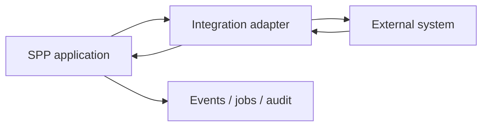

# 77. Platform Services: Environment, Integrations, Language, Logging and Media

> Evidence level: **Implemented** at the module boundary; individual features and production wiring must be verified against the current source before being treated as normative configuration.

## 77.1 Why these belong in the platform map

A framework becomes a platform when cross-cutting concerns are available through coherent runtime boundaries. The current source rescan identified `sppenv`, `sppintegrations`, `spplang`, `spplogger`, and `sppmedia` as first-party areas.

They should be learned after the core runtime, routing, modules, persistence, and security because their value is clearest when the learner already understands application boundaries.

## 77.2 SPPEnv

Environment management separates deployment-specific configuration from application code. Teach the principle first:

```text
source code
    ↓
configuration contract
    ↓
environment-specific values
    ↓
runtime configuration
```

Secrets should not be hard-coded into source files. Environment configuration should also be validated and documented so a missing value fails predictably rather than producing a late, obscure runtime error.

## 77.3 SPPIntegrations

Integration code connects SPP to systems outside the application's ownership boundary. The existing repository contains integration-oriented documentation and source areas, but integration behavior must be verified against the current implementation before presenting a specific third-party adapter as universally available.

The correct design pattern is:



An adapter should isolate external protocol details from domain logic. Authentication, retries, idempotency, timeouts, webhook verification, and observability are part of the integration contract—not optional decorations.

## 77.4 SPPLang

Language/internationalization services should be treated as application presentation and content concerns with runtime support. Separate:

- translation lookup;
- locale selection;
- formatting;
- pluralization;
- content that is genuinely language-neutral.

Never concatenate translated fragments merely because the English sentence happens to permit it; sentence structure can differ across languages.

## 77.5 SPPLogger

Logging is not the same thing as debugging output. A platform logger should support consistent severity, context, and operational correlation. When teaching logging, emphasize structured events and useful context over indiscriminate message volume.

A production log record should make it possible to answer: **what happened, where, under which request/job, and with what outcome?** Avoid placing credentials, bearer tokens, private keys, or unnecessary personal data into logs.

## 77.6 SPPMedia

Media handling deserves its own boundary because uploaded/generated assets have different lifecycle concerns from ordinary application records: storage location, metadata, validation, transformations, delivery, retention, and access control.

Treat a media identifier as a reference to an asset lifecycle, not as permission to expose a file publicly.

## 77.7 Cross-cutting example

A document-upload feature illustrates how the platform services interact:

1. SPPEnv supplies deployment configuration.
2. SPPAuth establishes who may upload.
3. SPPMedia validates/stores the asset.
4. SPPDB stores durable business metadata.
5. SPPCache may cache derived metadata where appropriate.
6. SPPLogger records operational outcomes.
7. SPPLang renders user-facing status messages.
8. SPPIntegrations can notify an external system if the business workflow requires it.

This is the kind of integrated architecture the handbook should teach rather than presenting each module as an isolated API catalog.

## 77.8 Source-first rule

Module presence establishes that a subsystem exists. It does **not** by itself prove every feature mentioned in older tutorials. Before copying an old example into production documentation, verify the current source, configuration, tests, and command definitions.

## 77.9 Source anchors

- `spp/modules/spp/sppenv/`
- `spp/modules/spp/sppintegrations/`
- `spp/modules/spp/spplang/`
- `spp/modules/spp/spplogger/`
- `spp/modules/spp/sppmedia/`
- existing integration tutorials under `spp/docs/tutorials/` and `docs/tutorials/`
