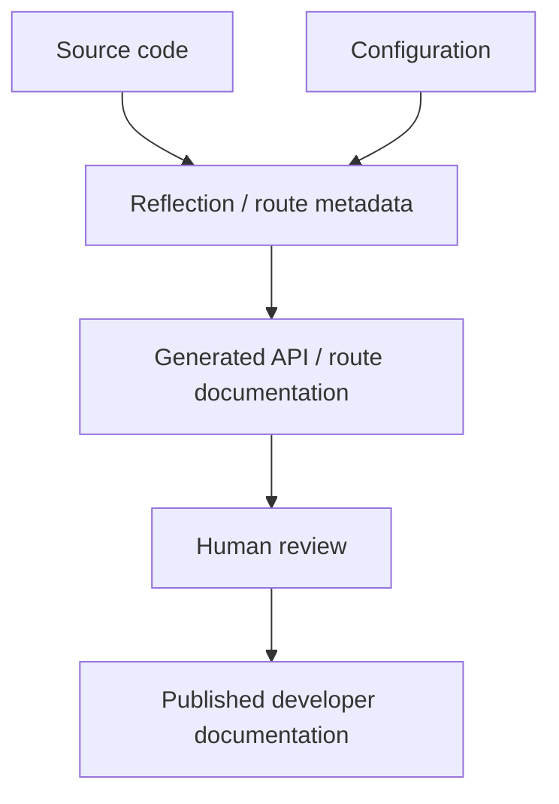

# 78. Developer Tooling: SPPMaker and SPPDocs

> Evidence level: **Implemented** for the current first-party areas; command-level details should be checked against the current CLI/source before use.

## 78.1 Why tooling is part of the framework

Framework productivity is determined not only by runtime classes but also by how reliably developers can create, inspect, document, test, and maintain those classes. The current source rescan identifies `sppmaker` and the SPPDocs documentation tooling as first-party platform concerns.

## 78.2 SPPMaker

SPPMaker should be taught as a scaffolding/maintenance aid, not as a replacement for understanding the generated code. The correct workflow is:

```text
requirement
   ↓
choose architectural artifact
   ↓
run generator/scaffolder
   ↓
inspect generated source
   ↓
add domain-specific behavior
   ↓
test and document
```

Generated code is still application code. A developer must understand its lifecycle, dependencies, security boundary, and conventions before modifying or deploying it.

## 78.3 SPPDocs

Current generated documentation evidence identifies the `SppDocs` namespace and classes including `SPPDocGenerator` and `SPPRouteDocCollector`. The preceding repository history also records creation of the `sppdocs` area.

The handbook treats SPPDocs as **framework documentation tooling**. It is not a tutorial about hosting this handbook itself.

## 78.4 Documentation as a build artifact

For a serious framework project, documentation should have traceable inputs:



Generated documentation is valuable because it can reduce drift between implementation and reference material. It does not eliminate the need for conceptual documentation, migration notes, security guidance, or examples.

## 78.5 What belongs in generated documentation

Good candidates include:

- public classes and methods;
- routes and route metadata;
- API contracts;
- configuration schemas where machine-readable metadata exists;
- generated examples or reference indexes.

Poor candidates for blind generation include architectural rationale, migration strategy, threat models, and teaching explanations. Those require editorial context.

## 78.6 Tooling lab

Take a small SPP module and produce a documentation pipeline that records:

1. source entry points;
2. generated reference material;
3. human-written conceptual explanation;
4. source/version baseline;
5. verification steps.

Then intentionally change a public method and determine which documentation changes can be generated and which require human editing.

## 78.7 Source-first warning

The existence of SPPMaker/SPPDocs does not establish a specific CLI command, output directory, or deployment process. Those details should be copied into the handbook only after verifying the corresponding current command/source implementation.

## 78.8 Source anchors

- `spp/modules/spp/sppmaker/`
- current `SppDocs` generated/source evidence
- route/API documentation components under `spp/modules/spp/sppapi/`
