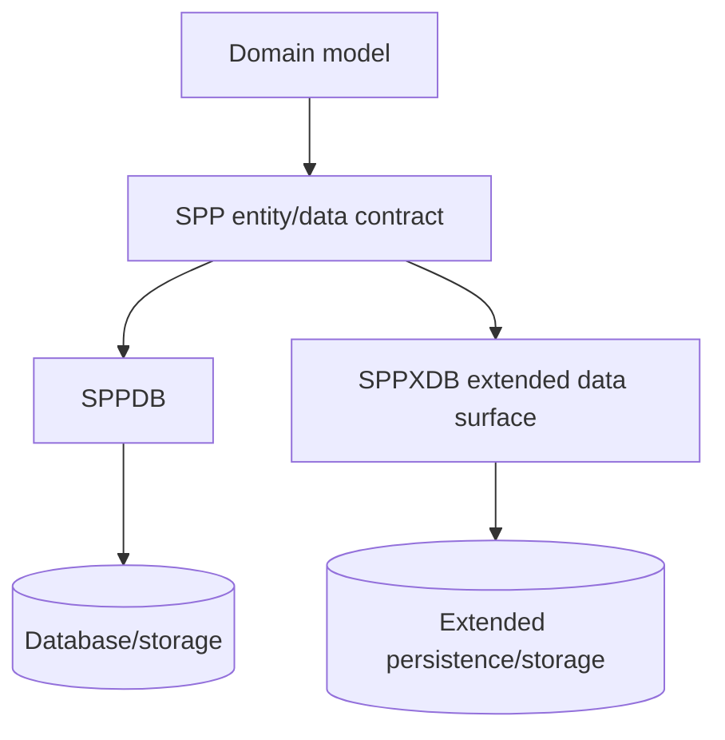

# 79. SPPXDB: Teaching the Extended Data/Entity Surface Safely

> Evidence level: **Documented/Derived** until each SPPXDB behavior is tied to current executable source and tests. This chapter deliberately avoids inventing a public API where the current source baseline has not been fully verified.

## 79.1 Why SPPXDB gets a separate chapter

SPPXDB appears in the current platform documentation/source inventory and is significant enough to deserve explicit curriculum placement. It should not be silently folded into the introductory SPPDB lesson because learners need to understand what problem the extended surface solves and where it sits relative to the ordinary persistence/entity layer.

## 79.2 First principle: establish the boundary

Before using an SPPXDB feature, answer three questions:

1. Is this an alternate persistence mechanism, an extension of entity behavior, or an integration abstraction?
2. Which existing SPPDB contract does it reuse?
3. What additional lifecycle, query, storage, or operational guarantees does it introduce?

The answers must come from the current source and tests. Names alone are insufficient evidence.

## 79.3 Architectural placement

This is a conceptual teaching map, not a claim that every entity must use both paths.

## 79.4 How to document an extended data feature

Every SPPXDB feature added to the handbook should specify:

- source file/class;
- supported input/output contract;
- lifecycle and transaction semantics;
- supported storage backends;
- error behavior;
- concurrency assumptions;
- security implications;
- migration path from ordinary SPPDB usage;
- tests or fixtures demonstrating the behavior.

This prevents the handbook from becoming a list of plausible-sounding abstractions.

## 79.5 Migration lesson

A useful advanced exercise is to start with an ordinary SPPDB-backed entity and identify where the application's requirements exceed that model. Only then introduce the corresponding SPPXDB facility.

The learner should be able to explain **why** the extension is required and what new operational obligations it creates.

## 79.6 Evidence discipline

For this subsystem, the handbook intentionally uses cautious language until the source rescan is complete at class/method/test level. When a future source pass verifies a concrete SPPXDB contract, replace the relevant sections with exact examples and link them from the feature inventory.

## 79.7 Curriculum position

Recommended sequence:

`SPPDB → entities → transactions/data lifecycle → SPPDBPool → SPPXDB → caching/derived data → production data architecture`.

This keeps the advanced abstraction grounded in a known baseline.
