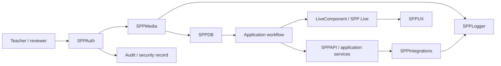

# 80. September 2026 Platform Reference Map

> Evidence level: **Derived from the September 2026 source rescan**, with module names treated as source-backed and detailed behavior deferred to the dedicated chapters/source anchors.

This chapter is the bridge between the conceptual handbook and the growing reference layer. It answers one practical question: **where should a developer look when a real application requirement crosses several SPP subsystems?**

## 80.1 Requirement-to-subsystem map

| Requirement | Primary SPP area | Supporting areas |
|---|---|---|
| HTTP entity API | SPPAPI | SPPAuth, SPPDB, middleware, events |
| Login / identity | SPPAuth | sessions, guards, SPPAPI |
| Role/policy enforcement | SPPAuth | API, entities, middleware |
| Persistent application data | SPPDB | SPPDBPool, SPPXDB |
| Reuse expensive results | SPPCache | SPPDB, events |
| Cryptographic material | SPPCrypto | SPPEnv, SPPAuth |
| Deployment configuration | SPPEnv | SPPLogger, SPPIntegrations |
| External service connection | SPPIntegrations | SPPAuth, SPPLogger, queues/events |
| Localization | SPPLang | SPPView/Drishyam |
| Operational diagnostics | SPPLogger | request/job context, SPPAuth audit |
| Uploaded/managed assets | SPPMedia | SPPDB, SPPAuth, storage |
| Scaffolding | SPPMaker | modules, configuration, tests |
| API/route reference generation | SPPDocs | SPPAPI, routing metadata |
| Server-side reactive UI | LiveComponent | SPPView, SPP Live |
| Browser-side reactivity | SPPUX | SPPView/Drishyam, LiveComponent |

## 80.2 Cross-subsystem request

Consider: “A teacher uploads a document, an authorized reviewer approves it, the UI updates without a full page reload, and an external records system receives a notification.”

The architecture is not one feature. It is a chain:

This is an architectural composition example. It does not claim that SPP automatically wires these modules together in this exact sequence.

## 80.3 How to choose the boundary

Use the smallest subsystem that owns the responsibility:

- Do not put authorization rules into a media storage helper.
- Do not make a cache the source of truth for durable business state.
- Do not put external protocol details into domain entities.
- Do not put UI state rules into persistence classes.
- Do not put cryptographic key material into ordinary application configuration when a protected key-management boundary is available.
- Do not turn generated documentation into the only explanation of an architecture.

## 80.4 Source verification checklist

Before adding a feature claim to the handbook:

- [ ] Identify the current source directory/class.
- [ ] Read the executable implementation.
- [ ] Find tests/fixtures if present.
- [ ] Inspect configuration consumed by the implementation.
- [ ] Check existing tutorials for older behavior.
- [ ] Mark the evidence level.
- [ ] Give a concrete example only after the contract is understood.
- [ ] Add a failure mode and a “when not to use it” note.

## 80.5 Current deep-dive status

The September documentation pass has now created dedicated handbook coverage for:

- SPPAPI;
- SPPAuth;
- SPPDB / SPPDBPool / SPPCache / SPPCrypto boundaries;
- SPPEnv / SPPIntegrations / SPPLang / SPPLogger / SPPMedia;
- SPPMaker / SPPDocs tooling;
- SPPXDB's curriculum position.

The next source-deepening pass should turn the most important of these into executable labs, beginning with **SPPAPI and SPPAuth**, then data/cache/crypto, then platform tooling and integrations.

## 80.6 Relationship to the main learning path

Do not read this chapter as a replacement for the beginner sequence. It is a reference map for experienced readers and for learners who have reached the architecture stage.

The intended progression remains:

**framework fundamentals → SPP runtime → request/middleware/events → modules/configuration → presentation → data → security → APIs/workflow → operations → reactive UI → integrations → enterprise architecture.**
