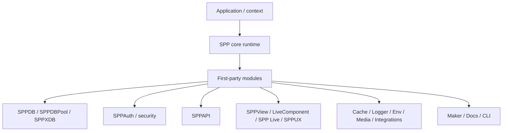
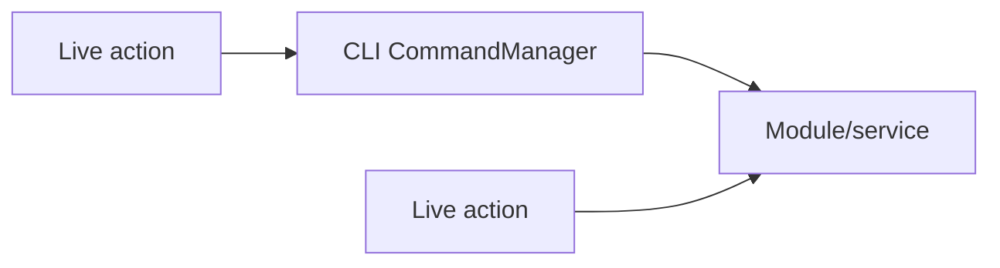
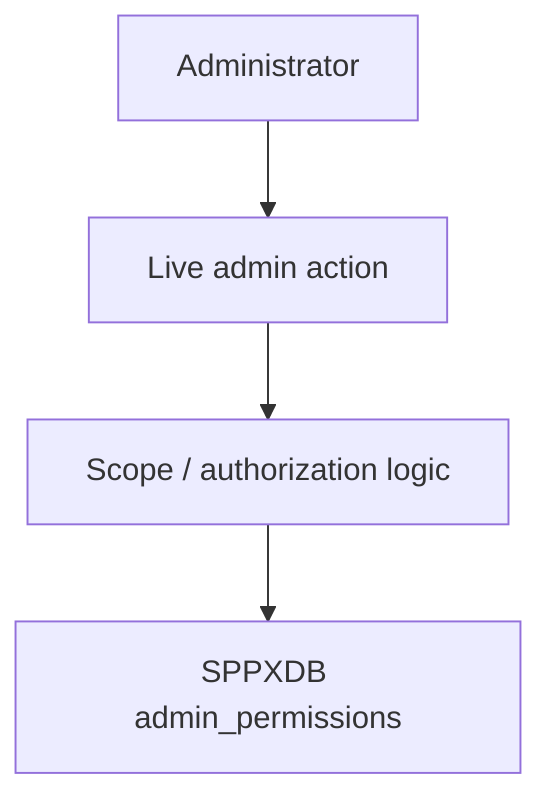

# 81. September 2026 Architecture Delta Audit

> Evidence level: **Implemented/Derived** where tied to the September source commits; **Guidance** for recommendations. This chapter is an architecture audit, not a claim that every changed behavior is a desired design.

## 81.1 Why this audit exists

The September source line is not merely a documentation refresh. The repository has moved from the August snapshot, and the latest commits include sanitisation/refactoring work. The handbook therefore needs to distinguish:

- architectural changes that affect how SPP is taught;
- implementation changes that change a subsystem boundary; and
- changes that are potentially risky or require regression tests.

The comparison also shows that `handbook-v3` is currently a **diverged documentation branch** relative to the September source tip. It must not be described as a clean fast-forward of `main`.

## 81.2 High-level delta

At the September baseline, the architecture is best understood as a platform with these layers:

This is a teaching map. It does not imply that every application loads every module.

## 81.3 Important source change: direct command invocation is being reduced in live actions

The September sanitisation commit changes several administrative/live paths from invoking CLI commands through `CommandManager::execute()` to calling the underlying service/module APIs directly.

One concrete example is the AI live action. The older path executed `admin:ai`; the newer path loads `sppai`, selects an optional provider/model, and calls the SPP AI facade directly.

### Architectural consequence

This is a meaningful boundary improvement when the live request already has access to the application service layer:

The handbook should therefore teach **CLI commands and programmatic module APIs as separate interfaces**, rather than treating the CLI as the universal internal API.

## 81.4 Administrative authorization is now more visibly coupled to session + scope data

The sanitisation diff removes diagnostic file logging from the administrative scope path and makes the decision flow explicit around session existence, configured super-admin identity, and XDB-backed permission records.

The implementation also contains a development-oriented fallback that can return all scopes for non-super-admin users when the XDB permission record is absent. This must **not** be taught as a production authorization guarantee.

### Security interpretation

The handbook should teach the following separation:

| Concern | Correct teaching model |
|---|---|
| Authentication | Establish who the requester is. |
| Authorization | Determine what that identity may do. |
| Scope lookup | Obtain permissions from the configured source. |
| Development fallback | Convenience behavior; must be audited before production use. |
| Missing session | Fail closed for HTTP administrative requests. |

This is a concrete reason the security chapters must remain source-first.

## 81.5 Admin permissions are persisted through SPPXDB in the current path

The updated live administrative permission action reads and writes an `admin_permissions` record through `SPPMod\\SPPXDB\\SPP_XDB`.

That gives the handbook a concrete architectural relationship:

The important teaching point is not that XDB is universally the authorization store. It is that **this current administrative path uses XDB for a permission record**, and therefore data-platform and security architecture intersect here.

## 81.6 Audit-log retrieval moved toward direct SPPDB access

The sanitisation changes an administrative audit-log live path from invoking an audit CLI command to querying SPPDB directly. The implementation caps the requested page size, discovers the configured table name through the database abstraction, detects SQLite table availability, counts records, and retrieves a bounded page.

### Architectural consequence

The operational stack is now easier to teach as:

`Live UI → authorization gate → SPPDB query → bounded result → UI`

rather than:

`Live UI → CLI subprocess-like command abstraction → audit command → database`

The handbook should still verify the exact production database and audit-installation behavior before promising portability across every driver.

## 81.7 SPPAPI has a distinct application-facing request boundary

The current SPPAPI implementation explicitly:

1. identifies API requests using `__api=1` or `X-SPP-API: 1`;
2. requires a Bearer token;
3. fires an API token-verification event;
4. resolves an entity class;
5. checks explicit API exposure metadata;
6. dispatches GET/POST/PUT/PATCH/DELETE through API controllers; and
7. uses an API middleware pipeline.

This should be taught as an **API boundary layered on top of the SPP runtime**, not as a completely independent framework.

## 81.8 Current SPPAPI security implication

The source contains both `setAuthValidator()` / `checkAuth()` and a request-specific `authenticateRequest()` path. These should not be collapsed into one generic authentication story without tracing all call sites.

The normative handbook rule is:

> Document the exact entry point being taught, then trace the validator/event/middleware path it actually uses.

Do not infer that registering an auth validator automatically changes every API authentication path merely because both concepts appear in the same class.

## 81.9 Branch topology is itself an architecture/documentation risk

The September comparison reports `handbook-v3` as diverged from the September `main` tip: the branch is ahead by many documentation commits but also behind the source branch by 37 commits.

Therefore:

- handbook commits should continue on `handbook-v3`;
- source-current audits must compare against the current `main` baseline;
- merging/rebasing the handbook branch is a separate repository operation and should not be silently performed as part of documentation writing;
- a future release process should record the exact source commit against which the handbook was audited.

## 81.10 What this changes in the curriculum

The architecture delta changes the teaching emphasis in five places:

1. **CLI vs service APIs** — teach them as separate interfaces.
2. **Security** — distinguish identity, scope resolution, and authorization storage.
3. **SPPXDB** — show a real current administrative use case rather than only a conceptual data abstraction.
4. **SPPAPI** — teach the request boundary, entity exposure check, middleware, and controller dispatch together.
5. **Source auditing** — teach branch/source divergence as part of maintaining technical documentation.

## 81.11 Regression questions raised by the audit

These are audit questions, not claims of bugs:

- Is the non-super-admin all-scope fallback intentionally restricted to development environments?
- Are XDB permission queries safely parameterized/escaped for every supported identifier format?
- Are all API authentication paths consistently wired to the intended validator/event mechanism?
- Does direct service invocation preserve every behavior previously supplied by the CLI command wrappers?
- Does direct SPPDB audit retrieval preserve authorization, pagination, filtering, and driver portability?
- Which September source changes require new Parikshak coverage?

These questions belong in the engineering/test backlog, while the handbook should accurately document the currently implemented behavior.

## 81.12 Audit conclusion

The September architecture is not a simple expansion of the feature list. Several paths are moving toward **direct module/service boundaries**, while security and data responsibilities are becoming more explicitly interconnected.

The handbook should consequently present SPP as an integrated runtime with explicit subsystem boundaries, and should resist the older pattern of describing every capability as an isolated command or class.
