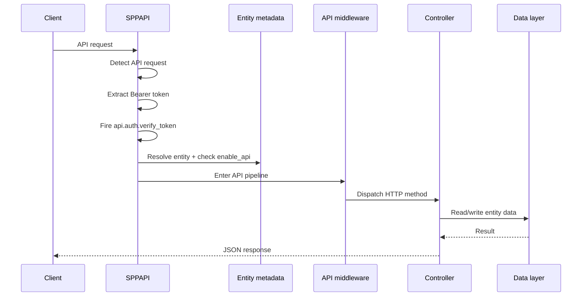

# 82. Lab: Build and Break an SPPAPI + Security Path

> Evidence level: **Implemented/Guidance**. The request boundary described here follows the current SPPAPI implementation. Exact application scaffolding and command names should be verified against the target application before running the lab.

## 82.1 What you are building

This lab teaches the complete boundary instead of treating an API as just a controller:



## 82.2 Step 1 — understand the API gate

The current implementation only treats a request as an SPP API request when either:

- the query parameter `__api` is `1`; or
- the `X-SPP-API` request header is `1`.

Then it requires a Bearer token. The token is passed through the `api.auth.verify_token` event using an `EventParams` object containing the token and an `is_valid` flag.

**Important:** this is not the same as saying that every SPP route is automatically an API route.

## 82.3 Step 2 — understand entity exposure

After authentication, SPPAPI resolves the requested entity class. It then checks whether API exposure is explicitly enabled through entity metadata.

This is a useful security design lesson:

> Having an entity in the application does not, by itself, mean that the entity should become externally accessible.

The handbook should therefore teach **existence** and **exposure** as separate concepts.

## 82.4 Step 3 — understand method dispatch

The current SPPAPI implementation maps methods as follows:

| HTTP method | SPPAPI controller path |
|---|---|
| GET | `EntityGetController` |
| POST | `EntityPostController` |
| PUT | `EntityPutPatchController` |
| PATCH | `EntityPutPatchController` |
| DELETE | `EntityDeleteController` |
| Other | 405 response |

The request then passes through an API middleware pipeline before the controller callback is executed.

## 82.5 Break the lab: remove the API exposure flag

Create or select an entity that is otherwise valid, then disable its API exposure metadata.

Expected lesson:

- the entity can still exist;
- the API request can still reach SPPAPI;
- the API must reject access because exposure is not enabled.

Do not “fix” this by bypassing the metadata check. The check is part of the boundary being studied.

## 82.6 Break the lab: omit the Bearer token

Send the same API request without:

```text
Authorization: Bearer <token>
```

Expected result: the API authentication gate rejects the request with an unauthorized response.

The point of the exercise is to distinguish **authentication failure** from **entity exposure failure**.

## 82.7 Break the lab: use an unsupported HTTP method

Use an HTTP method that is not handled by the current dispatch switch.

Expected result: `405 Method Not Allowed`.

This teaches that an API controller is not merely a PHP class with arbitrary callable methods; the request boundary defines which operations are accepted.

## 82.8 Trace the source

Start with:

```text
spp/modules/spp/sppapi/class.sppapi.php
```

Then follow the references to:

```text
spp/modules/spp/sppapi/Controllers/
spp/modules/spp/sppapi/Dispatchers/
spp/modules/spp/sppapi/OpenAPI/
spp/modules/spp/sppapi/Subscribers/
```

Do not begin by reading every API class. Start from `SPPAPI::handle()` and follow only the calls made by the request you are tracing.

## 82.9 Add security tests

A source-driven API test suite should cover at least:

1. non-API request is ignored by the API entry point;
2. API request without Bearer token is rejected;
3. invalid token is rejected;
4. missing entity is rejected;
5. unknown entity is rejected;
6. entity without API exposure is rejected;
7. GET dispatches correctly;
8. POST dispatches correctly;
9. PUT and PATCH share their intended controller path;
10. DELETE dispatches correctly;
11. unsupported method returns 405;
12. controller exceptions are converted to the documented error response.

The exact test harness and fixtures must be taken from the repository's current Parikshak/test conventions rather than invented for the handbook.

## 82.10 Architecture exercise

Now compare two designs:

### Design A — controller-centric teaching

`HTTP → controller → database`

### Design B — SPP boundary teaching

`HTTP → API detection → authentication → entity exposure → API middleware → controller → data`

Design B is the correct mental model for this lab because it explains where security and policy checks happen relative to dispatch.

## 82.11 Migration exercise

If you are coming from another framework, map your existing stack:

| Existing concept | SPP question |
|---|---|
| Route | How does this request enter SPPAPI? |
| Authentication middleware | Which SPP API authentication/event path handles it? |
| Controller | Which SPPAPI controller/dispatcher handles the method? |
| Model exposure | Is API exposure explicitly enabled? |
| Serializer/resource | Which SPPAPI response/resource surface is used? |
| OpenAPI generation | Which current SPPAPI documentation path generates/describes the endpoint? |

The goal is architectural translation, not class-for-class copying.

## 82.12 Completion criteria

You have completed the lab when you can explain, without looking at the source:

- how SPP decides that a request is an API request;
- where Bearer-token verification enters the flow;
- why an entity can exist without being API-exposed;
- how HTTP methods reach the controller layer;
- where API middleware sits;
- how an API error differs from an application/database error; and
- which source files you would inspect when the request behaves unexpectedly.
