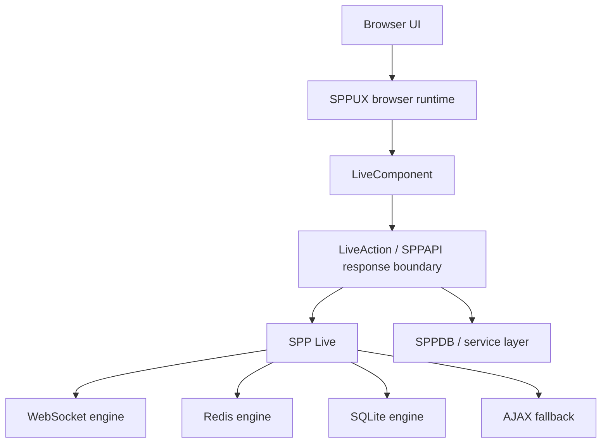
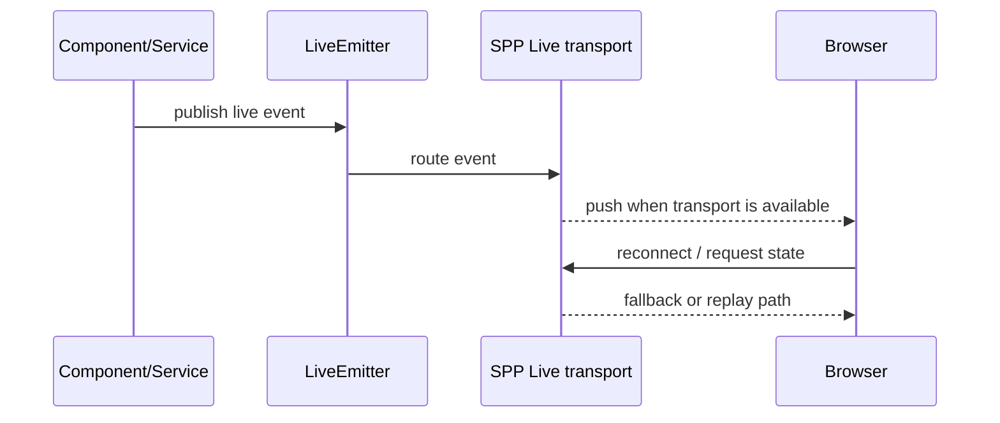

# 83 — Live Architecture Delta Audit

> Evidence level: **Implemented where source is cited; Derived where the handbook connects components.**
>
> This chapter records the current live/reactive architecture that must be taught as an integrated system rather than as four unrelated features.

## 83.1 The architectural stack

SPP's live UI path is layered:

The important teaching point is that **LiveComponent, LiveAction, SPP Live, and SPPUX solve different layers of the same interaction problem**. They should not be presented as competing replacements.

## 83.2 LiveAction is an interaction-response abstraction

Current source evidence shows LiveAction constructing a unified response containing operations such as replacement, morphing, attribute changes, append/prepend/remove, redirects, notifications, store synchronization, server-side rendering, modal operations, refresh, dispatch, scripts, alerts, assignment, calls, clearing state, and related instructions. Its `send()` path delegates the final response through the AJAX response mechanism.

This means the handbook should teach LiveAction as a **server-side instruction builder / response contract**, not merely as another controller type.

## 83.3 SPP Live is the transport layer

The transport subsystem provides multiple engine implementations. The current architecture includes WebSocket, Redis, and SQLite-oriented engines, with AJAX fallback paths. `LiveEmitter` is the bridge for publishing live events.

Conceptually:

Do not teach the transport choice as an application-level concern unless the source/configuration explicitly requires it. The application should primarily express the live event or response; the transport layer handles delivery.

## 83.4 LiveComponent is stateful server-side UI

LiveComponent owns component lifecycle and dehydrated public state. Current implementation evidence includes boot/mount lifecycle hooks, signed dehydrated state, `wire:id`, hydration/dehydration, lazy behavior, computed values, URL/session attributes, events, streaming/download behavior, and server-rendered templates.

The security lesson is significant: **browser-visible component state is not equivalent to trusted server state**. The lifecycle must validate and restore state according to the component contract.

## 83.5 SPPUX is the browser-side integration layer

SPPUX provides the browser runtime/facade that connects server-rendered or component-generated markup to reactive behavior and application services. The source tree includes component discovery, mount/island concepts, API/service/stream bridges, and asset/runtime integration.

Therefore:

| Layer | Primary responsibility |
|---|---|
| LiveComponent | server-side component state and lifecycle |
| LiveAction | server-generated interaction instructions |
| SPP Live | live event transport |
| SPPUX | browser runtime and client integration |

## 83.6 What changed in the teaching model

The handbook should no longer describe these features as isolated "advanced UI" add-ons. The correct model is a **reactive application pipeline**:

**browser runtime → component/service interaction → server instruction/response → optional live event transport → browser update**.

This also explains why a conventional page, a LiveComponent, and an SPPUX-enhanced interface can coexist in one application.

## 83.7 Source-tracing checklist

When diagnosing a live feature, trace in this order:

1. Browser markup and SPPUX entry point.
2. Component/action endpoint or request boundary.
3. LiveComponent lifecycle/state handling, if a component is involved.
4. LiveAction response construction, if an instruction response is involved.
5. LiveEmitter/SPP Live if an asynchronous event is involved.
6. Selected transport engine and fallback behavior.
7. SPPDB/service layer if state persistence is involved.

Avoid starting with the WebSocket implementation when the actual defect is in component state or response construction.

## 83.8 Evidence boundary

The existence of multiple transport engines does not by itself prove distributed delivery guarantees, exactly-once semantics, ordering guarantees across nodes, or production-grade failover. Those claims require explicit implementation and test evidence.

Similarly, the presence of signed component state does not by itself establish a complete application-wide authorization model. Authorization must be traced to the relevant authentication, middleware, policy, and data paths.

## 83.9 Handbook integration

This audit should be read alongside:

- `07-livecomponent.md`
- `08-spp-live-transports.md`
- `09-sppux-runtime.md`
- `45-livecomponent-from-zero-to-kernel.md`
- `46-spp-live-transport-architecture.md`
- `47-sppux-browser-runtime-from-zero.md`

The goal is one coherent architecture story, not another parallel feature inventory.
