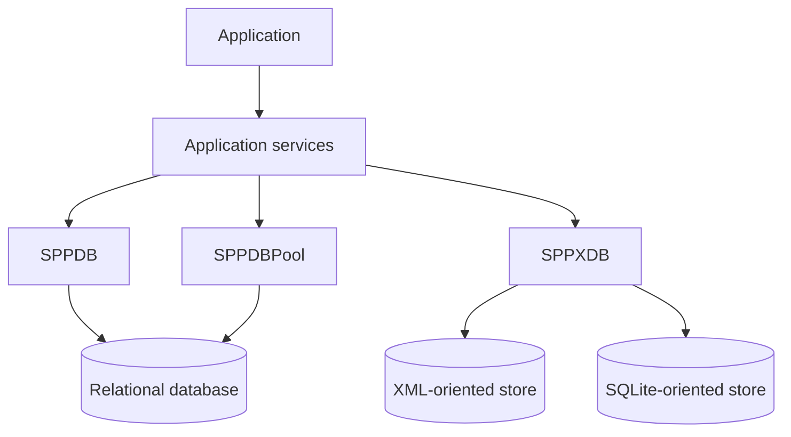
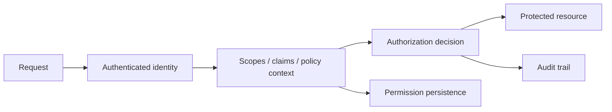
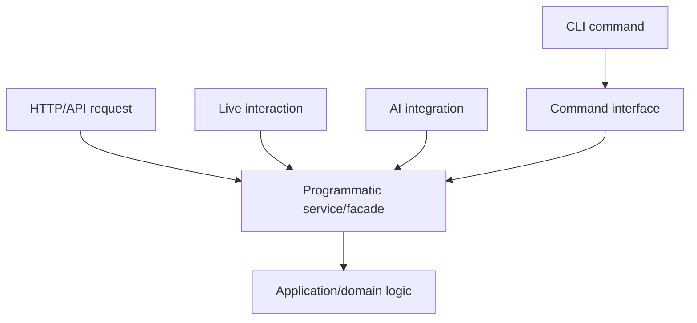
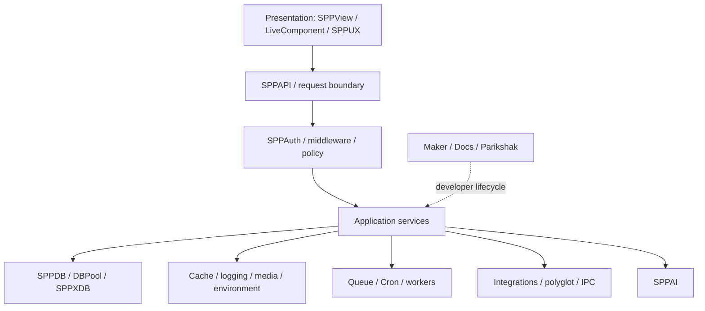

# 84 — Data, Identity, and Platform Architecture Delta

> Evidence level: **Implemented where source is cited; Derived for architectural relationships.**
>
> The current SPP architecture is broader than the request/rendering/live stack. Data access, identity, authorization, API exposure, caching, cryptography, environment management, integrations, language support, logging, media, tooling, and documentation form a platform layer around the application runtime.

## 84.1 Data is not a single database abstraction

The current source tree exposes distinct persistence roles, including SPPDB, SPPDBPool, and SPPXDB. SPPXDB is a separate optional subsystem with XML/SQLite-oriented database engines, model and migration concepts.

The teaching consequence is important: **SPPXDB should not be described as merely another name for SPPDB**. Explain the abstraction and its actual source-backed use cases separately.

## 84.2 Identity and authorization are a platform concern

SPPAuth is a broad security subsystem. Repository documentation describes capabilities including MFA, passwordless magic links, ABAC, OAuth 2.0, and SCIM 2.0. These descriptions should be treated as implementation claims to verify feature-by-feature, not as proof that every deployment automatically has a complete zero-trust security posture.

The current administrative authorization path also demonstrates why identity and authorization need their own architectural treatment: permissions are associated with session/scope information and persisted through SPPXDB-backed records in the examined source path.

A useful model is:

Do not collapse authentication, identity, authorization, and audit into one generic "security middleware" concept.

## 84.3 API exposure is an explicit boundary

The current SPPAPI path has a recognizable request gate: API mode can be selected by `__api=1` or `X-SPP-API: 1`; bearer authentication is processed through the API authentication event; entities must satisfy the relevant API exposure metadata; HTTP methods then dispatch to dedicated controllers.

This is architecturally different from simply adding JSON output to an MVC route.

| Concern | SPPAPI role |
|---|---|
| API request detection | explicit API boundary |
| Authentication | bearer-token verification/event path |
| Exposure | explicit entity/API metadata |
| Dispatch | method-specific API controllers |
| Middleware | API middleware pipeline |
| Documentation | OpenAPI/documentation integration |

The handbook should therefore teach API exposure as a **contract at the entity/request boundary**, not only as a routing trick.

## 84.4 CLI is not the internal service API

Recent source inspection shows paths that previously could be conceptualized as command execution now invoking application facades/services directly. This is an important architectural distinction:

A CLI command is an interface. A service/facade is an internal programmatic contract. The handbook must not teach `CommandManager::execute()` as a universal substitute for calling the underlying service.

## 84.5 Cross-cutting platform services

The current source layout includes distinct modules/services for cache, cryptography, environment/configuration, integrations, language/i18n, logging, media, maker/scaffolding, and generated documentation.

These should be taught as **platform services surrounding application features**, rather than as unrelated utilities. For example:

- cache affects performance and consistency decisions;
- crypto affects key custody and protected data handling;
- environment management affects deployment configuration;
- integrations affect trust and process boundaries;
- language support affects presentation/content architecture;
- logging affects diagnosis and operational visibility;
- maker affects developer workflow and generated artifacts;
- documentation generation affects discoverability of the framework's public surface.

## 84.6 Audit and permission storage need source-level caution

The current architecture includes direct database access for audit retrieval and XDB-backed administrative permission records in the examined paths. It also contains development-oriented fallback behavior when an expected permission record is absent.

That fallback is **not** evidence of a production authorization guarantee. A production handbook example must distinguish:

1. normal configured permission storage;
2. development/test fallback behavior;
3. explicit authorization policy;
4. audit recording.

## 84.7 What belongs in the handbook architecture model

The coherent model is now:

This is a better mental model than treating SPP as MVC plus a collection of optional plugins.

## 84.8 Evidence boundary

The presence of a subsystem, class, command, or documentation page is not sufficient to claim that every advertised capability is complete, secure, distributed, or production-ready. The handbook should label implementation state explicitly and point readers to source/tests for high-impact claims.

In particular, do not infer from module names alone:

- distributed consistency;
- cryptographic guarantees beyond the implemented primitive/path;
- universal authorization enforcement;
- transaction semantics across subsystems;
- guaranteed failover;
- compliance certification;
- production readiness of every optional module.

## 84.9 Recommended chapter integration

This audit should feed into, rather than duplicate, the existing chapters:

- `16-database-and-storage.md`
- `17-authentication-and-authorization.md`
- `18-cache-logging-workflow.md`
- `19-cli-and-developer-tooling.md`
- `42-reporting-observability-and-diagnostics.md`
- `43-queue-cron-and-background-execution.md`
- `44-spai-and-ai-integration.md`
- `48-polyglot-ipc-and-external-application-architecture.md`
- `49-multi-application-enterprise-deployment.md`
- `74-sppapi.md`
- `75-sppauth.md`
- `76-data-cache-crypto-pools.md`
- `77-platform-services.md`
- `78-maker-and-docs-toolchain.md`
- `79-sppxdb.md`

The next documentation pass should reconcile these chapters with this architecture model instead of creating more feature-only chapters.
