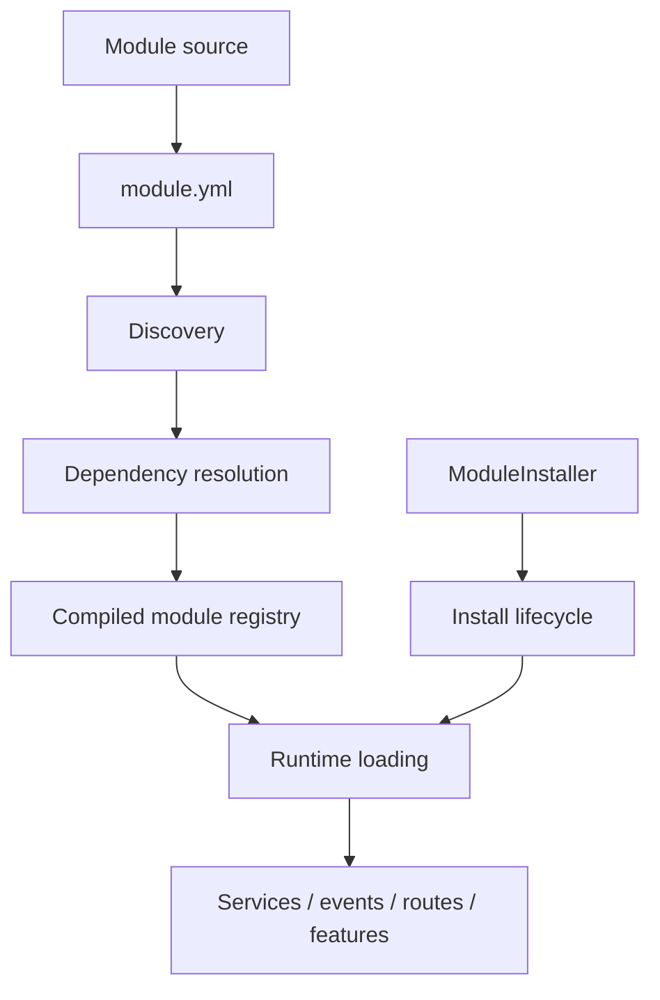
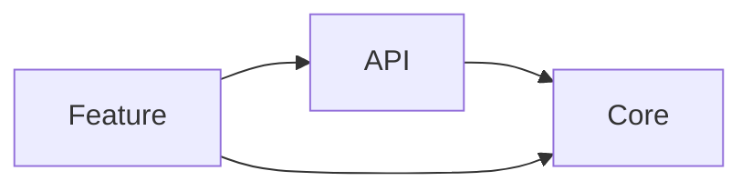

# 85. Framework-Level Module Development Guide

This chapter is the **framework/module-author guide**. It answers a different question from application development:

> How do I build a reusable SPP module that participates correctly in discovery, dependency resolution, installation, configuration, runtime registration, and the compiled module registry?

## 85.1 The module author's mental model

An SPP module is a framework-recognized feature unit, not simply a directory of PHP files. The repository's module architecture is built around `Module`, `ModuleCompiler`, and `ModuleInstaller`, together with module registries and manifests.



**Source landmarks:** `spp/core/class.module.php`, `spp/core/class.modulecompiler.php`, `spp/core/class.moduleinstaller.php`, module registries, and the existing module-development guide.

## 85.2 Framework module versus application module

Use a framework-level module when the capability is intended to be reusable across applications or to extend SPP itself.

| Question | Framework module | Application module |
|---|---|---|
| Reuse | Across applications | Usually one application |
| Ownership | Framework/platform | Application/team |
| Dependencies | Framework/module contracts | Application capabilities/modules |
| Configuration | Exposes configurable capability | Supplies application-specific values |
| Release lifecycle | Independent feature lifecycle | Usually tied to application release |

The same technical module machinery can support both, but their architectural responsibilities differ.

## 85.3 Start with the contract

Before writing implementation code, define:

1. module identity;
2. supported SPP version assumptions;
3. dependencies;
4. configuration surface;
5. runtime contributions;
6. installation/uninstallation behavior where required;
7. public classes/services/events;
8. tests and failure cases;
9. documentation and examples.

A module should have a reason to exist beyond collecting unrelated helpers.

## 85.4 Manifest design

A first-party module can expose metadata through `module.yml`. Existing repository examples use fields such as:

```yaml
name: example_feature
version: 1.0.0
includes:
  - class.example.php
deps:
  - spp
config_variables:
  enabled:
    type: boolean
    label: Enabled
```

Treat the manifest as machine-consumed metadata. Do not add fields merely because another framework uses them; verify that the current SPP compiler consumes them.

## 85.5 Dependency discipline

Dependencies are part of the module graph, not comments.



The module compiler resolves dependencies before producing the compiled registry and detects missing/circular dependencies.

Rules for module authors:

- declare every required module;
- do not rely on incidental load order;
- avoid circular dependencies;
- keep optional integrations genuinely optional;
- prefer a small dependency surface.

## 85.6 Runtime contributions

A module may contribute different kinds of framework behavior. Keep each contribution explicit:

```text
module metadata
configuration
PHP classes
services / DI registrations
events/listeners
routes/pages
views/assets/resources
CLI commands
installation data/schema
```

Not every module needs every category.

## 85.7 Installation is not loading

SPP distinguishes installation from runtime loading. `ModuleInstaller` is used by application-facing module-management services and commands for installation operations.

Think in separate stages:

```text
install → discover → activate → compile → load → execute
```

Do not put irreversible application behavior into discovery merely because it is convenient.

## 85.8 Installation and uninstall hooks

Repository module examples contain `install.php` and `uninstall.php`. Installation examples obtain a database through `ModuleInstaller::getDb()` and can perform setup such as initial rows, directories, or integration state. Uninstall examples treat database-table removal as an explicit decision rather than an automatic assumption.

A responsible module should make destructive behavior explicit and document retention semantics.

## 85.9 Configuration ownership

Separate three things:

```text
module metadata
      ↓
what can be configured

application configuration
      ↓
what this installation chooses

runtime settings
      ↓
what execution currently reads
```

The module author owns the capability contract; the application owns its chosen values.

## 85.10 Public API design

A framework module should expose a deliberately small public surface.

Prefer:

```text
stable service/facade
stable interfaces
explicit events
well-defined configuration
```

over exposing internal compiler/loader details to application code.

If an application needs to know how the module cache is internally assembled, that is usually a sign that the module's public boundary needs improvement.

## 85.11 Testing a framework module

Use **Parikshak**, the primary SPP testing engine, where the module behavior is testable through SPP/application boundaries.

Minimum matrix:

| Test | Purpose |
|---|---|
| Discovery | Module can be found |
| Dependency | Required modules are present |
| Missing dependency | Failure is explicit |
| Configuration | Defaults and overrides behave correctly |
| Installation | Required setup occurs |
| Runtime | Public capability works |
| Failure | Invalid input fails at the intended boundary |
| Uninstall | Cleanup semantics are understood |

The Parikshak subsystem includes `TestCase`, `SPPTestCase`, `SPPTestRunner`, and related test infrastructure.

## 85.12 Deliberate failure lab

Break the module intentionally:

1. remove a declared dependency;
2. introduce a dependency cycle;
3. corrupt a required configuration value;
4. remove a runtime include;
5. break installation setup;
6. change a public service contract.

For each failure, identify whether it belongs to:

```text
discovery
→ dependency resolution
→ compilation
→ installation
→ runtime loading
→ feature execution
```

## 85.13 Source-tracing exercise

Start with a module manifest and trace:

```text
module.yml
  ↓
Module
  ↓
ModuleCompiler
  ↓
dependency ordering
  ↓
compiled module cache
  ↓
application runtime
```

The compiler's application-specific cache and dependency normalization are central to this path.

## 85.14 Framework module quality checklist

Before publishing a framework module:

- [ ] unique module identity;
- [ ] explicit dependencies;
- [ ] minimal public API;
- [ ] configuration documented;
- [ ] install/uninstall semantics documented;
- [ ] no hidden destructive setup;
- [ ] Parikshak coverage;
- [ ] deliberate failure tests;
- [ ] source map;
- [ ] examples for application developers;
- [ ] version/compatibility assumptions documented;
- [ ] no claims stronger than implementation evidence.

## Kernel Hacker

The important architectural insight is that an SPP module is a **composition unit**. Its manifest is declarative input; the compiler turns that input into normalized executable framework state. `ModuleInstaller` is a separate lifecycle concern.

That distinction should remain visible in every framework-level module design.

### Source map

- `spp/core/class.module.php`
- `spp/core/class.modulecompiler.php`
- `spp/core/class.moduleinstaller.php`
- `spp/etc/modules.yml`
- `spp/etc/modules.xml`
- `src/modules/testmod/install.php`
- `src/modules/testmod/uninstall.php`
- `spp/commands/ModuleInstallCommand.php`
- `spp/commands/ModuleEnableCommand.php`
- `spp/dev/services/Modules.php`
- `documentation/handbook/16-module-development-from-zero.md`
