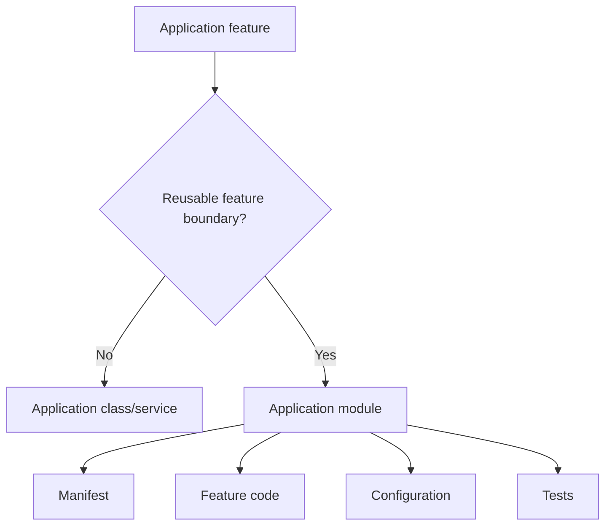
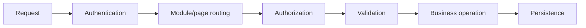

# 86. Application-Level Module Development Guide

This chapter is the **application developer's module guide**.

It answers:

> How do I package an application-specific feature as an SPP module without turning the application's bootstrap, controllers, and business logic into a tangled collection of includes?

## 86.1 What belongs in an app module?

An application module is useful when a feature has a recognizable lifecycle and boundary.

Examples:

```text
src/myapp/modules/
    reporting/
    admissions/
    notifications/
    inventory/
```

The existing SPP module-development material documents application-local module directories and describes them as a place for reusable application features. fileciteturn621file0L1-L2

A module is a good fit when the feature has several of these:

- configuration;
- entities/data;
- routes/pages;
- services;
- events;
- views/assets;
- commands;
- installation/setup;
- tests.

For a small helper, use a class/service instead.

## 86.2 Module versus ordinary application code

The architectural choice is:



Do not create a module simply to make the directory tree look sophisticated.

## 86.3 A practical application-module layout

Start small:

```text
src/myapp/modules/tasks/
  module.yml
  module.php
  config.yml
  install.php
  uninstall.php
  src/
  pages/
  resources/
  tests/
```

Not every directory is mandatory. Add only what the feature actually contributes and verify conventions against the installed SPP version.

## 86.4 The manifest

Begin with the module's identity and dependencies:

```yaml
name: tasks
version: 1.0.0
deps:
  - spp
```

Then add configuration metadata or other manifest fields only when the current compiler supports them.

The manifest is machine-readable runtime metadata, not merely documentation. Existing SPP module examples use fields such as `name`, `version`, `includes`, `deps`, and `config_variables`. fileciteturn621file0L1-L2

## 86.5 Application ownership

Keep the boundary clear:

```text
framework module
    ↓
reusable platform capability

application module
    ↓
business/domain feature

application service/class
    ↓
small local implementation detail
```

For example, “email transport” may be a reusable platform capability while “student admission notifications” belongs to the school application.

## 86.6 Build the feature vertically

Do not build an empty module containing twenty directories first.

Build one vertical slice:

```text
manifest
→ configuration
→ service
→ route/page
→ persistence if required
→ authorization
→ test
```

Then add events, background jobs, views, API exposure, LiveComponent, or SPPUX only when the feature needs them.

## 86.7 Example: Task Desk module

Suppose the application already has a Task Desk. Move the feature into:

```text
src/myapp/modules/tasks/
```

The module owns:

```text
Task entity
Task service
Task routes
Task validation
Task authorization
Task views
Task tests
```

The application should not need to know the module's internal file layout merely to use the feature.

## 86.8 Configuration

A module should expose configuration deliberately.

For example:

```yaml
notifications:
  enabled: true
  reminder_minutes: 30
```

The module defines what the setting means; the application installation chooses its value.

Do not put secrets directly into a module manifest or source file. Use the application's supported configuration/environment mechanisms.

## 86.9 Services and dependency injection

Application modules should prefer SPP's Registry/DI mechanisms over manually constructing long dependency chains.

Conceptually:

```text
Controller / Page
       ↓
TaskService
       ↓
Repository / SPPDB abstraction
```

This keeps business behavior out of route/page glue and makes the service easier to test.

## 86.10 Routes belong to the feature boundary

If a module owns a feature's pages, keep its routing contribution close to that feature.

The actual routing paradigm may be `pages.yml`, `#[Route]`, or another supported application mechanism. Routing and module discovery are separate concerns: the module makes the feature available; the routing system decides how requests reach its pages.

## 86.11 Events

Use events when another part of the application should react without tightly coupling itself to the module's internal implementation.

Example concept:

```text
Task completed
      ↓
application event
      ├── notification listener
      ├── audit listener
      └── reporting listener
```

Do not turn every method call into an event. Events are useful when the extension point itself matters.

## 86.12 Persistence

An application module should own its domain persistence model while using the application's supported SPP data abstractions.

Keep this distinction:

```text
module domain model
        ↓
SPPDB abstraction
        ↓
XDB / concrete storage engine
```

Do not couple ordinary business code directly to low-level storage internals unless the module's responsibility genuinely requires it.

## 86.13 Installation

If a module needs database setup, seed data, directories, or external integration configuration, make that lifecycle explicit.

The repository contains application module examples with `install.php` and `uninstall.php`; installation examples obtain a database through `ModuleInstaller::getDb()` and document possible setup operations. fileciteturn618file6L105-L113

Installation is not the same as runtime loading.

## 86.14 Uninstallation and data retention

Never assume that uninstall means “delete everything”.

The repository's example uninstall guidance explicitly leaves database-table removal as an optional decision because retaining data can prevent loss. fileciteturn618file8L132-L139

For production modules, document:

```text
code removal
configuration removal
schema retention
content retention
external webhook cleanup
cache cleanup
```

## 86.15 Authorization boundary

A module should not assume that reaching its controller/page means the caller is authorized.

Think in layers:



Authentication, authorization, validation, and persistence protect different boundaries.

## 86.16 Testing with Parikshak

Parikshak is the primary SPP testing engine. Test the module at multiple boundaries:

| Test | Question |
|---|---|
| Discovery | Can the application discover the module? |
| Configuration | Are defaults/overrides correct? |
| Route | Does the feature resolve correctly? |
| Authorization | Is an unauthorized operation rejected? |
| Validation | Is invalid input rejected? |
| Service | Does the domain operation work? |
| Persistence | Is state stored correctly? |
| Installation | Does required setup work? |
| Failure | Does the expected boundary reject bad state? |

The repository exposes `SPPTestCase`, `SPPTestResponse`, and `SPPTestRunner` as part of the Parikshak infrastructure. fileciteturn607file3L59-L69

## 86.17 Deliberate failure exercise

Break the Task module one boundary at a time:

1. disable or remove its dependency;
2. corrupt configuration;
3. create an invalid route;
4. submit unauthorized input;
5. violate entity validation;
6. force a persistence failure;
7. break an installation prerequisite.

For every failure record:

```text
symptom
→ first failing boundary
→ responsible subsystem
→ source landmark
→ correct repair
```

## 86.18 Module API versus internal implementation

If another application component needs the feature, expose a stable service/facade or other deliberate public boundary.

Avoid making consumers depend on:

```text
internal directory names
compiled module-cache structure
private helper classes
installation implementation details
```

This makes later refactoring much safer.

## 86.19 When NOT to make an application module

Do not create a module when:

- the code is one small helper;
- there is no independent feature boundary;
- the code is used only once;
- a normal service/class is sufficient.

Conversely, if a feature has its own configuration, routes, persistence, tests, and lifecycle, a module becomes increasingly attractive.

## 86.20 Developer workflow

Use this repeatable loop:

```text
Problem
→ define feature boundary
→ create manifest
→ declare dependencies
→ build one vertical slice
→ enable/discover
→ test with Parikshak
→ deliberately break it
→ trace the failing layer
→ add integration points
→ document public API
```

This follows the handbook's broader learning model rather than treating module creation as a file-generation exercise.

## 86.21 Application-module checklist

- [ ] clear business capability;
- [ ] module identity;
- [ ] explicit dependencies;
- [ ] minimal manifest;
- [ ] configuration boundary;
- [ ] service/DI boundary;
- [ ] routing boundary;
- [ ] authorization and validation;
- [ ] persistence boundary where required;
- [ ] install/uninstall semantics;
- [ ] Parikshak tests;
- [ ] deliberate failure lab;
- [ ] documented public API;
- [ ] no unsupported framework guarantees.

### Source map

- `spp/core/class.module.php`
- `spp/core/class.modulecompiler.php`
- `spp/core/class.moduleinstaller.php`
- `src/modules/testmod/install.php`
- `src/modules/testmod/uninstall.php`
- `src/modules/testappmod/install.php`
- `src/modules/testappmod/uninstall.php`
- `spp/commands/ModuleInstallCommand.php`
- `spp/commands/ModuleEnableCommand.php`
- `documentation/handbook/16-module-development-from-zero.md`
- `documentation/handbook/20-testing-and-debugging.md`
