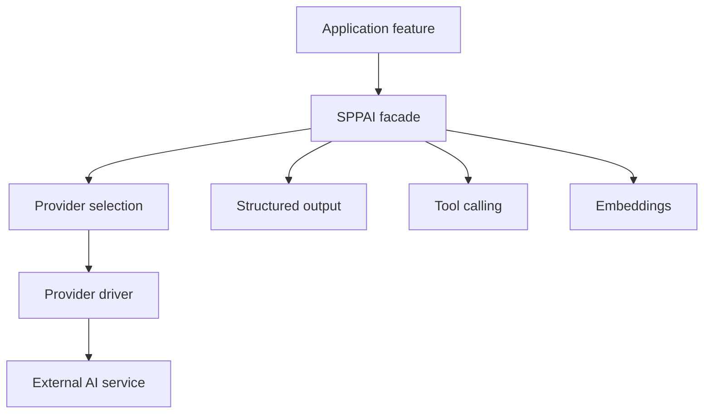
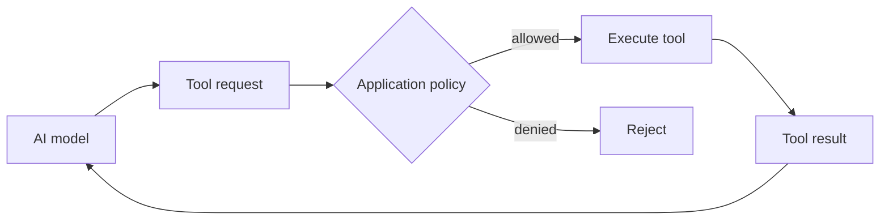
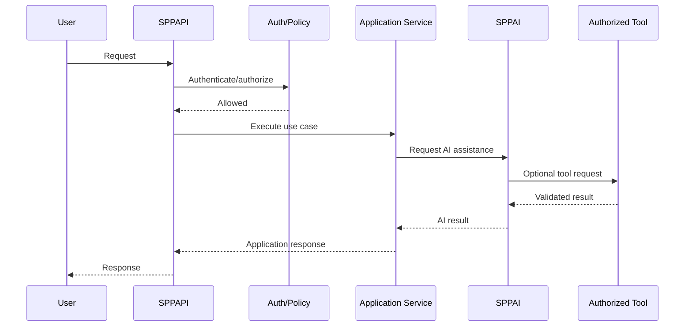

# 87. SPPAI Developer Guide

This chapter moves from “what is SPPAI?” to **how an SPP developer should integrate AI without confusing provider selection, application logic, tools, structured output, or security boundaries**.

## 87.1 The core model

SPPAI is a facade/provider architecture. Application code can select a provider/model and request capabilities without hard-coding every provider-specific client detail.



The current facade exposes provider selection, model selection, completion, chat, embeddings, tool calling, structured output, and registry access. Provider configuration maps named providers to driver classes.

## 87.2 Source-backed facade surface

The current `SPPAI` facade exposes methods conceptually equivalent to:

```text
using(provider)
withModel(model)
complete(prompt, options)
chat(messages, options)
createEmbedding(text)
callTool(prompt, tools, options)
structured(prompt, jsonSchema, options)
getRegistry()
```

The important architectural boundary is that application code can ask for an AI capability through the facade while provider-specific behavior remains behind a driver boundary.

## 87.3 Provider configuration

The current configuration includes provider-to-driver mappings for providers including Google/Gemini, OpenAI/ChatGPT, Anthropic/Claude, DeepSeek, and Sarvam.

Treat these as configured integrations, not as proof that every provider offers identical behavior. Model names, options, limits, tool semantics, structured-output behavior, and error behavior can differ.

## 87.4 Temporary provider/model selection

Use provider/model selection as request-local intent rather than spreading provider-specific branching through business code.

Conceptually:

```php
$answer = SPPAI::using('google')
    ->withModel('configured-model')
    ->complete($prompt, $options);
```

The exact model name should come from the installation's configuration rather than being invented by the handbook.

## 87.5 Plain AI call versus structured application operation

There are two very different uses:

```text
“write a summary”
        ↓
free-form completion
```

versus:

```text
business request
        ↓
structured prompt
        ↓
JSON schema
        ↓
validated application object
```

Prefer structured output when downstream code needs machine-readable data. Still validate the result at the application boundary; an AI model is not a substitute for application validation or authorization.

## 87.6 Tool calling

Tool calling introduces an important trust boundary:



Never interpret “the model requested it” as authorization.

A tool should have:

- a narrow contract;
- validated parameters;
- explicit authorization;
- bounded side effects;
- observable execution;
- predictable failure behavior.

## 87.7 AI and application services

Keep business operations behind application services even when AI initiates them.

Bad boundary:

```text
AI response → arbitrary SQL / arbitrary filesystem operation
```

Better boundary:

```text
AI intent
→ validated command/tool
→ authorized application service
→ normal SPP persistence/security boundary
```

This keeps AI as an input/orchestration mechanism rather than granting it implicit application authority.

## 87.8 Embeddings

Embeddings are useful for similarity-oriented features such as semantic search or retrieval pipelines.

A robust application separates:

```text
source document
→ chunking/indexing policy
→ embedding generation
→ vector representation
→ retrieval
→ application authorization
→ answer generation
```

Do not assume that an embedding call automatically creates a complete retrieval-augmented generation system.

## 87.9 Provider abstraction versus provider equivalence

The facade gives the application a common entry point. It does **not** mean providers are behaviorally identical.

| Concern | Common boundary | Provider-specific risk |
|---|---|---|
| Chat | `chat()` | message/options semantics |
| Completion | `complete()` | prompt/model behavior |
| Embeddings | `createEmbedding()` | dimensions/model semantics |
| Tools | `callTool()` | tool-call format/limits |
| Structured output | `structured()` | schema support/strictness |

Design portable application logic around the common contract and explicitly test provider-specific assumptions.

## 87.10 AI configuration and secrets

Provider credentials belong in supported environment/configuration mechanisms, not source-controlled application code.

A configuration example should use an environment reference rather than a literal secret:

```yaml
api_key: env:AI_PROVIDER_KEY
```

The current SPP configuration documentation describes environment interpolation. Verify the exact syntax against the installed configuration implementation before deployment.

## 87.11 AI manifest security boundary

SPPAI can generate an AI manifest containing API metadata. The current source-backed audit identified an important boundary: the generated manifest currently describes authentication as `none`.

Therefore:

> **An AI manifest is not automatically a zero-trust security boundary.**

Authentication and authorization must be established by the API/application boundary that exposes the capability.

This is a deliberate handbook warning because feature metadata and security enforcement are separate concerns.

## 87.12 Testing AI features with Parikshak

AI tests should focus on deterministic application boundaries rather than assuming a remote model will return identical prose every time.

Test:

```text
provider selection
configuration failure
missing credential
structured schema handling
tool authorization
invalid tool arguments
application-service rejection
fallback/error handling
empty response
unexpected model output
```

For expensive or nondeterministic remote calls, isolate provider integration tests from deterministic application-service tests where the architecture permits.

## 87.13 Deliberate failure lab

Build a tool that changes a Task Desk status.

Then deliberately:

1. remove its required authorization;
2. send malformed arguments;
3. request an impossible state transition;
4. disable the provider credential;
5. return malformed structured data.

The goal is to prove that AI input still passes through ordinary application security and validation boundaries.

## 87.14 AI + LiveComponent + SPPUX

A useful progression is:

```text
plain PHP form
→ server-side AI service
→ LiveComponent action
→ SPP Live update
→ SPPUX reactive interface
```

The UI technology changes; the authorization and business-service boundary should not.

## 87.15 AI + SPPAPI

A production-oriented architecture can expose an AI-assisted operation through SPPAPI:



AI should remain downstream of the application's trust boundary for privileged operations.

## 87.16 When NOT to use SPPAI

Do not use AI when a deterministic rule is clearer, cheaper, safer, and easier to test.

Examples:

- authorization decisions;
- financial calculations;
- schema validation;
- security policy evaluation;
- deterministic workflow transitions;
- exact database constraints.

AI can assist these workflows without replacing their authoritative mechanisms.

## 87.17 Kernel Hacker source trace

Trace an AI request as:

```text
application
→ SPPAI facade
→ provider/model resolution
→ AIDriver interface
→ concrete provider driver
→ external provider
→ normalized application result
```

Then separately trace:

```text
AI manifest
→ generated API metadata
→ authentication boundary
```

The second trace is essential because generated API metadata and actual request authorization are different concerns.

## 87.18 Developer checklist

- [ ] provider/model selection is configuration-aware;
- [ ] business logic does not depend on provider-specific internals unnecessarily;
- [ ] structured output is validated;
- [ ] tools have explicit authorization;
- [ ] AI never receives implicit authority over privileged operations;
- [ ] credentials are externalized;
- [ ] deterministic rules remain deterministic;
- [ ] Parikshak covers application boundaries;
- [ ] remote-provider assumptions are tested separately;
- [ ] AI API exposure is authenticated/authorized independently;
- [ ] AI manifest metadata is not mistaken for security enforcement.

### Source map

- `spp/modules/optional/sppai/class.sppai.php`
- `spp/modules/optional/sppai/int.aidriver.php`
- `spp/modules/optional/sppai/etc/config.yml`
- `documentation/handbook/44-spai-and-ai-integration.md`
- `documentation/handbook/63-feature-evidence-and-status-model.md`
