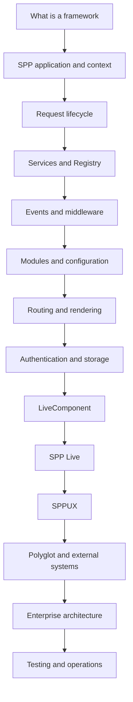

# SPP Framework Handbook

## Canonical Documentation

This directory is the canonical Markdown source for the SPP Framework Handbook on branch `handbook-v2`.

The handbook is a **learning book plus an implementation reference**. It assumes the reader may know a programming language but may have no idea what a framework is, why frameworks exist, or how the parts of a framework cooperate. Advanced readers can use the **Kernel Hacker** sections and source maps to jump directly into implementation details.

## Audience tracks

**Explorer** — learn what a framework is, what an SPP application is, and how a request travels through the runtime.

**Builder** — build applications using services, modules, events, middleware, routing, SPPView, authentication, storage, LiveComponent, SPP Live, and SPPUX.

**Architect** — design application boundaries, multi-application systems, external integrations, polyglot runtimes, trust boundaries, and deployment topology.

**Kernel Hacker** — trace the implementation, caches, compilers, adapters, lifecycle rules, and runtime contracts in source.

## Evidence policy

Every substantial claim is classified internally as **Implemented**, **Documented**, **Derived**, **Guidance**, or **Proposed**.

The order of authority is:

1. executable source;
2. tests and fixtures;
3. configuration/manifests consumed by the source;
4. repository documentation;
5. architectural interpretation.

When older documentation is stronger than the implementation establishes, the canonical handbook follows the source/tests and records important discrepancies instead of copying unsupported guarantees.

## Diagram policy

- **Mermaid** is used for genuine architecture, lifecycle, sequence, decision, and data-flow diagrams.
- **Code blocks** are reserved for PHP/JavaScript/YAML/XML/CLI commands, literal directory layouts, configuration, and actual output.
- **Tables** are used for simple comparisons and relationships.
- **Prose/lists** are used for explanations and procedures.

Every diagram must be useful, source-accurate, simple enough to understand, and valid for GitHub rendering. Decorative or redundant diagrams are removed.

## Current handbook chapters

### Foundations

- [00 — Research status and learning order](00-handbook-status.md)
- [01 — Introduction to SPP](01-getting-started.md)
- [02 — Scheduler and application contexts](02-kernel-scheduler.md)
- [03 — Registry and IoC container](03-registry-and-container.md)
- [04 — Events, EventHandler, and SPPEvent](04-events-and-event-handlers.md)
- [05 — Module discovery, manifests, and compiled registry](05-modules-and-manifests.md)

### Presentation and reactive architecture

- [06 — SPPView, extended BladeOne, and Drishyam](06-sppview-and-bladeone.md)
- [07 — LiveComponent](07-livecomponent.md)
- [08 — SPP Live transport engines](08-spp-live-transports.md)
- [09 — SPPUX runtime](09-sppux-runtime.md)

### Integration and security

- [10 — Polyglot bridges and external applications](10-polyglot-and-external-applications.md)
- [10A — Security and runtime contracts](10-security-and-runtime-contracts.md)

### Hands-on application development

- [11 — Total-nerd tutorial roadmap](11-nerd-tutorial-roadmap.md)
- [12 — Your first SPP application](12-first-spp-application.md)
- [13 — What happens to a request?](13-request-lifecycle.md)
- [14 — Middleware and request pipeline](14-middleware-and-request-pipeline.md)
- [15 — Routing and request dispatch](15-routing-and-request-dispatch.md)
- [16 — Database, SPPDB, and SPP XDB](16-database-and-storage.md)
- [17 — Authentication and authorization](17-authentication-and-authorization.md)
- [18 — Cache, logging, workflow, and operations](18-cache-logging-workflow.md)
- [19 — CLI and developer tooling](19-cli-and-developer-tooling.md)
- [20 — Testing, debugging, and source-driven diagnosis](20-testing-and-debugging.md)

### Enterprise and migration

- [21 — Enterprise architecture and deployment](21-enterprise-architecture-and-deployment.md)
- [22 — Complete plain PHP → SPP → LiveComponent → SPPUX tutorial](22-total-nerd-tutorial.md)
- [23 — Coming to SPP from other frameworks](23-coming-from-other-frameworks.md)
- [24 — Complete branched tutorial curriculum](24-tutorial-curriculum.md)

## The canonical learning path

## Tutorial tracks

### Track A — PHP fundamentals

Build the same Task Desk application in plain PHP, then migrate it into the SPP runtime and add services, persistence, middleware, events, validation, authentication, modules, views, and tests.

### Track B — LiveComponent

Upgrade only the genuinely interactive parts to LiveComponent, learning server-side component state, lifecycle, hydration/dehydration, validation, dispatch, streaming, lazy/isolated rendering, and transport separation.

### Track C — SPPUX

Add browser-side reactive islands using the actual SPPUX runtime: signals, computed state, batching, tagged templates, event delegation, scheduling, reconciliation, and error boundaries.

### Track D — Enterprise integration

Use multiple SPP application contexts where justified, then integrate selected capabilities with external or polyglot runtimes using explicit protocol and trust boundaries.

### Track E — Full capability curriculum

Use [Chapter 24](24-tutorial-curriculum.md) when the objective is not merely to learn SPP, but to **exercise the framework broadly**. It branches the learning path into data/forms, security, events/modules, workflow, SPPView, LiveComponent, SPP Live, SPPUX, polyglot integration, external applications, background work, operations, and enterprise multi-application deployment before bringing them together in a capstone.

## Source-first rule

The handbook never treats the existence of a class, method, or documentation paragraph as proof of a broad enterprise guarantee. Features such as distributed consensus, transaction semantics, correlation propagation, protocol security, or transport behavior must be tied to concrete implementation evidence before they are described as current SPP behavior.
