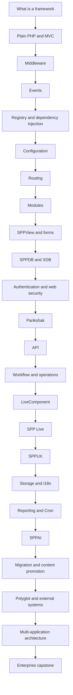

# SPP Framework Handbook

## Canonical Documentation

This directory is the canonical Markdown source for the SPP Framework Handbook on branch `handbook-v2`.

The handbook is a **learning book plus an implementation reference**. It assumes the reader may know a programming language but may have no idea what a framework is, why frameworks exist, or how the parts of a framework cooperate. Advanced readers can use the **Kernel Hacker** sections and source maps to jump directly into implementation details.

## Audience tracks

**Explorer** — learn what a framework is, what an SPP application is, and how a request travels through the runtime.

**Builder** — build applications using services, modules, events, middleware, routing, SPPView, authentication, storage, LiveComponent, SPP Live, SPPUX, APIs, workflow, and testing.

**Architect** — design application boundaries, multi-application systems, external integrations, polyglot runtimes, trust boundaries, migration/promotion, workers, and deployment topology.

**Kernel Hacker** — trace the implementation, caches, compilers, adapters, lifecycle rules, and runtime contracts in source.

## Evidence policy

Every substantial claim is classified internally as **Implemented**, **Documented**, **Derived**, **Guidance**, or **Proposed**.

The order of authority is:

1. executable source;
2. tests and fixtures;
3. configuration/manifests consumed by the source;
4. repository documentation;
5. architectural interpretation.

When older documentation is stronger than the implementation establishes, the canonical handbook follows the source/tests and records important discrepancies instead of copying unsupported guarantees.

## Diagram policy

- **Mermaid** is used for genuine architecture, lifecycle, sequence, decision, and data-flow diagrams.
- **Code blocks** are reserved for PHP/JavaScript/YAML/XML/CLI commands, literal directory layouts, configuration, and actual output.
- **Tables** are used for simple comparisons and relationships.
- **Prose/lists** are used for explanations and procedures.

Every diagram must be useful, source-accurate, simple enough to understand, and valid for GitHub rendering. Decorative or redundant diagrams are removed.

## Current handbook chapters

### Foundations

- [00 — Research status and learning order](00-handbook-status.md)
- [01 — Introduction to SPP](01-getting-started.md)
- [02 — Scheduler and application contexts](02-kernel-scheduler.md)
- [03 — Registry and IoC container](03-registry-and-container.md)
- [04 — Events, EventHandler, and SPPEvent](04-events-and-event-handlers.md)
- [05 — Module discovery, manifests, and compiled registry](05-modules-and-manifests.md)

### Presentation and reactive architecture

- [06 — SPPView, extended BladeOne, and Drishyam](06-sppview-and-bladeone.md)
- [07 — LiveComponent](07-livecomponent.md)
- [08 — SPP Live transport engines](08-spp-live-transports.md)
- [09 — SPPUX runtime](09-sppux-runtime.md)

### Integration and security

- [10 — Polyglot bridges and external applications](10-polyglot-and-external-applications.md)
- [10A — Security and runtime contracts](10-security-and-runtime-contracts.md)

### Reference and architecture

- [16 — Database, SPPDB, and SPP XDB](16-database-and-storage.md)
- [17 — Authentication and authorization](17-authentication-and-authorization.md)
- [18 — Cache, logging, workflow, and operations](18-cache-logging-workflow.md)
- [19 — CLI and developer tooling](19-cli-and-developer-tooling.md)
- [20 — Testing, debugging, and source-driven diagnosis](20-testing-and-debugging.md)
- [21 — Enterprise architecture and deployment](21-enterprise-architecture-and-deployment.md)
- [23 — Coming to SPP from other frameworks](23-coming-from-other-frameworks.md)

### Hands-on core tutorial — mandatory sequence

The following is the new **zero-level main tutorial**. Complete it in order.

1. [31 — From Plain PHP to Frameworks and MVC](31-tutorial-core-01-framework-mvc.md)
2. [32 — Middleware Pipeline](32-tutorial-core-02-middleware-pipeline.md)
3. [33 — Events and Event Handling](33-tutorial-core-03-events.md)
4. [34 — Registry and Dependency Injection](34-tutorial-core-04-registry-and-di.md)
5. [35 — Configuration and Settings](35-tutorial-core-05-configuration-settings.md)
6. [36 — Routing and MVC Dispatch](36-tutorial-core-06-routing-and-dispatch.md)
7. [37 — Modules](37-tutorial-core-07-modules.md)
8. [38 — SPPView, Forms, Validation](38-tutorial-core-08-sppview-views-forms.md)

The core tutorial is intentionally ordered this way: a beginner first understands what a framework and MVC are, then learns the request pipeline, events, dependency management, configuration, routing, feature packaging, and presentation.

### Specialized tutorial branches

- [39 — SPPDB/XDB Part 1: Data from Zero](39-tutorial-branch-sppdb-xdb-01.md)
- [40 — SPP XDB Part 2: Advanced Database Architecture](40-tutorial-branch-sppdb-xdb-02-advanced.md)
- [41 — Parikshak Testing Framework](41-tutorial-branch-parikshak.md)
- [42 — SPPAPI](42-tutorial-branch-api.md)
- [43 — Web Security Stack](43-tutorial-branch-web-security.md)
- [44 — Workflow, Approval Chains, Wizards](44-tutorial-branch-workflow.md)
- [45 — Storage, Internationalization, Reporting](45-tutorial-branch-storage-i18n-reporting.md)
- [46 — SPPAI](46-tutorial-branch-ai.md)
- [47 — Migration, Transfer, and Offline-to-Live Promotion](47-tutorial-branch-migration-transfer-promotion.md)
- [48 — LiveComponent](48-tutorial-branch-livecomponent.md)
- [49 — SPP Live Transports](49-tutorial-branch-spplive-transports.md)
- [50 — SPPUX](50-tutorial-branch-sppux.md)
- [51 — Polyglot and External Applications](51-tutorial-branch-polyglot-external.md)
- [52 — Multiple Applications, Cron, and Workers](52-tutorial-branch-multiapp-cron-workers.md)
- [53 — Enterprise Capstone](53-tutorial-enterprise-capstone.md)

### Learning and coverage maps

- [24 — Complete branched tutorial curriculum](24-tutorial-curriculum.md)
- [25 — Mandatory framework feature labs](25-framework-feature-labs.md)
- [26 — Parikshak testing reference/branch](26-parikshak-testing.md)
- [27 — Migration and transfer architecture](27-migration-transfer-promotion.md)
- [28 — Framework feature inventory](28-framework-feature-inventory.md)
- [29 — Feature coverage roadmap](29-feature-coverage-roadmap.md)
- [30 — Scaffold and code-generation coverage](30-scaffold-generator-coverage.md)

## The canonical learning path

## Mandatory learning rule

Every major framework subsystem follows the same learning loop:

**Learn → Build → Test with Parikshak → Deliberately break → Diagnose → Trace source → Learn when not to use it.**

A subsystem is not considered fully learned because the reader has read its reference chapter.

## Source-first rule

The handbook never treats the existence of a class, method, scaffold, or documentation paragraph as proof of a broad enterprise guarantee. Features such as distributed consensus, transaction semantics, correlation propagation, protocol security, transport behavior, AI recovery, or content-promotion guarantees must be tied to concrete implementation evidence before they are described as current SPP behavior.
