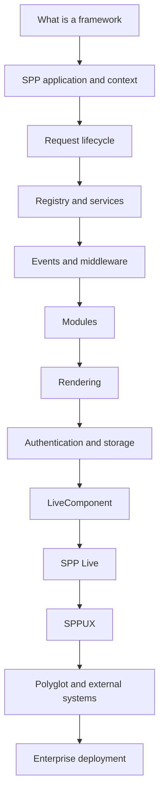

# SPP Framework Handbook

## Canonical Documentation

This directory is the canonical Markdown source for the SPP Framework Handbook on branch `handbook-v2`.

The handbook is source-driven and written as a learning book, not merely as an API index. It starts from the assumption that the reader may know PHP but may never have used a framework at all. Advanced readers can use the **Kernel Hacker** sections and source maps to jump directly into implementation details.

## How to read the handbook

### Explorer — zero framework knowledge

Start with Chapters 1, 12, and 13. They explain what a framework is, what an SPP application is, and what happens when a browser sends a request.

### Builder — application developer

Continue through Scheduler, Registry/IoC, events, modules, middleware, routing, SPPView, authentication, database access, testing, and the complete tutorial.

### Architect — enterprise and integration design

Focus on multi-application contexts, module boundaries, LiveComponent/SPP Live/SPPUX separation, polyglot integration, external applications, security boundaries, and deployment architecture.

### Kernel Hacker — implementation reader

Use the source maps and deep-dive sections to trace the exact classes, lifecycle stages, caches, adapters, compilers, and runtime contracts.

## Evidence policy

Every substantial claim is classified internally as **Implemented**, **Documented**, **Derived**, **Guidance**, or **Proposed**. Current executable source and tests take precedence over older prose documentation. Proposed architecture is never presented as existing framework behavior.

## Diagram policy

- **Mermaid** is used for genuine architecture, lifecycle, sequence, decision, and data-flow diagrams.
- **Code blocks** are reserved for PHP/JavaScript/YAML/XML/CLI commands, literal directory layouts, and actual output.
- **Tables** are used for simple comparisons and relationships.
- **Prose/lists** are used for explanations and procedures.

Every diagram should be source-accurate, useful, simple enough to understand, and valid for GitHub rendering. Decorative or redundant diagrams are removed.

## Current handbook chapters

- [00 — Research status and learning order](00-handbook-status.md)
- [01 — Introduction to SPP](01-getting-started.md)
- [02 — Scheduler and application contexts](02-kernel-scheduler.md)
- [03 — Registry and IoC container](03-registry-and-container.md)
- [04 — Events, EventHandler, and SPPEvent](04-events-and-event-handlers.md)
- [05 — Module discovery, manifests, and compiled registry](05-modules-and-manifests.md)
- [06 — SPPView, extended BladeOne, and Drishyam](06-sppview-and-bladeone.md)
- [07 — LiveComponent](07-livecomponent.md)
- [08 — SPP Live transport engines](08-spp-live-transports.md)
- [09 — SPPUX runtime](09-sppux-runtime.md)
- [10 — Polyglot bridges and external applications](10-polyglot-and-external-applications.md)
- [10 — Security and runtime contracts](10-security-and-runtime-contracts.md)
- [11 — Total-nerd tutorial roadmap](11-nerd-tutorial-roadmap.md)
- [12 — Your first SPP application](12-first-spp-application.md)
- [13 — What happens to a request?](13-request-lifecycle.md)
- [14 — Middleware and request pipeline](14-middleware-and-request-pipeline.md)
- [15 — Routing and request dispatch](15-routing-and-request-dispatch.md)
- [16 — Database, SPPDB, and SPP XDB](16-database-and-storage.md)
- [17 — Authentication and authorization](17-authentication-and-authorization.md)
- [18 — Cache, logging, workflow, and operations](18-cache-logging-workflow.md)
- [19 — CLI and developer tooling](19-cli-and-developer-tooling.md)
- [20 — Testing, debugging, and source-driven diagnosis](20-testing-and-debugging.md)
- [21 — Enterprise architecture and deployment](21-enterprise-architecture-and-deployment.md)
- [22 — Complete plain PHP → SPP → LiveComponent → SPPUX tutorial](22-total-nerd-tutorial.md)

## The canonical learning path

The handbook is deliberately layered:

## Source-first documentation rule

When the repository contains older documentation that makes a stronger claim than the executable implementation establishes, the handbook does not copy the stronger claim into the canonical explanation. Instead it records the discrepancy when it matters and follows the source/tests.

This rule is especially important for security, database guarantees, distributed systems, transport semantics, and lifecycle behavior.

## Tutorial tracks

### Track A — PHP fundamentals

Build the same Task Desk application first in plain PHP, then migrate it into the SPP runtime and add services, persistence, middleware, events, validation, authentication, modules, views, and testing.

### Track B — LiveComponent

Upgrade only the genuinely interactive parts to LiveComponent, learning server-side component state, lifecycle, hydration/dehydration, validation, dispatch, streaming, lazy/isolated rendering, and transport separation.

### Track C — SPPUX

Add browser-side reactive islands using the actual SPPUX runtime: signals, computed state, batching, tagged templates, event delegation, scheduling, reconciliation, and error boundaries.

### Track D — Enterprise integration

Split the system into multiple SPP application contexts where justified, then integrate selected capabilities with external or polyglot runtimes using explicit protocol and trust boundaries.

## Coming-from guides

The handbook will include conceptual migration guides for readers arriving from Laravel/Livewire, Symfony/Twig, Django, Spring Boot, ASP.NET Core, React, Vue, and Flutter. These are mappings of concepts, not claims that SPP implements the other framework APIs.
