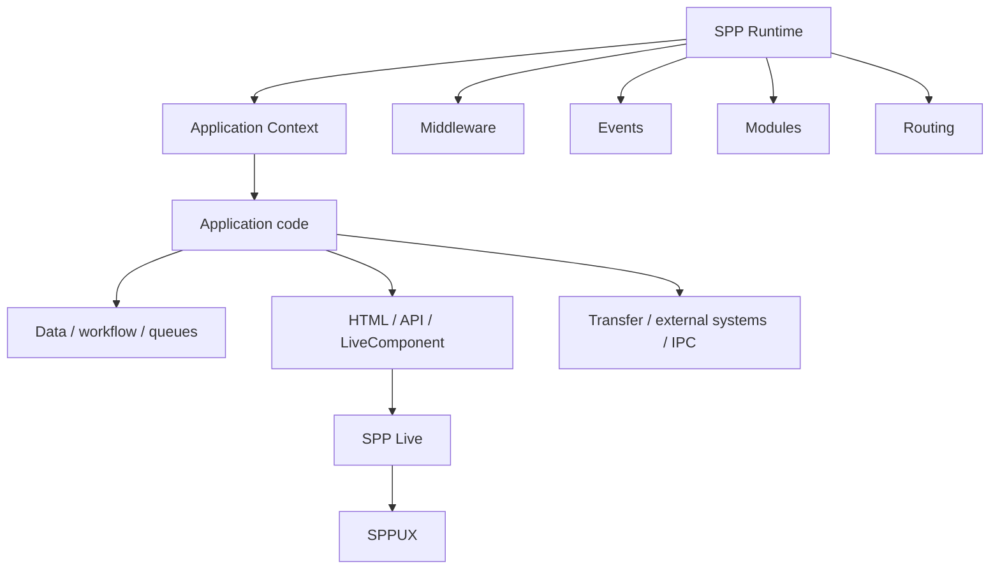

# SPP in the Framework Landscape

## Why this chapter exists

A developer who has learned one framework already has many useful mental models. The mistake is to assume that SPP must reproduce those models class-for-class.

This chapter answers a better question:

> **What kind of framework is SPP, and how does its architectural emphasis compare with other major frameworks?**

The comparison is deliberately architectural rather than marketing-oriented. Routing, middleware, dependency injection, events, ORM/database access, testing, and views are common framework concerns. Their mere presence does not make SPP unique.

The interesting question is how many concerns participate in the same SPP runtime and application model.

---

## 1. First principle: PHP is the language; SPP is the framework

Laravel, Symfony, and SPP are not alternative PHP languages. They are different ways of organizing PHP applications.

```text
PHP
 ↓
framework/runtime
 ↓
application code
```

A framework establishes conventions, runtime services, extension mechanisms, development tools, and boundaries that would otherwise be rebuilt from project to project.

---

## 2. A high-level comparison

| Concern | Laravel | Symfony | Django | SPP |
|---|---|---|---|---|
| MVC/web application structure | Core | Core | Core concepts | Supported, but not the whole platform |
| Dependency injection | Service container | Strong DI container | More convention/service based | Registry/container model |
| Middleware | Core | Core | Middleware stack | Middleware pipeline/kernel |
| Events | Core | Core | Signals/events | Event architecture with richer lifecycle semantics |
| Routing | Primarily code/attributes/conventions | Config/code/attributes | URL configuration | Multiple paradigms including `pages.yml`, attributes, API/live-oriented routes, CLI generation |
| CLI | Artisan | Console | `manage.py` | Broad CLI plus interactive SPP command environment |
| Data layer | Eloquent | Doctrine ecosystem | Django ORM | SPPDB + XDB/data abstractions |
| Testing | PHPUnit/Pest ecosystem | PHPUnit ecosystem | Django/Python test ecosystem | Parikshak plus repository test infrastructure |
| Server-side reactive UI | Livewire ecosystem | Symfony UX ecosystem | HTMX/other ecosystem | LiveComponent + SPP Live |
| Browser reactive runtime | Usually external/additional | Usually external/additional | Usually external/additional | SPPUX provides a dedicated runtime layer |
| Reporting | Usually package/application concern | Usually package/application concern | Usually package/application concern | SPPReport is a framework subsystem |
| Workflow | Usually package/application concern | Components/ecosystem | Usually package/application concern | Dedicated workflow architecture |
| Offline/content promotion | Usually deployment/tooling concern | Usually deployment/tooling concern | Usually deployment/tooling concern | Dedicated migration/transfer architecture |
| Multiple application contexts | Possible through deployment/architecture | Possible | Possible | Explicit application-context/runtime model |
| Polyglot/IPC | External integration | External integration | External integration | Explicit polyglot/IPC architecture |
| AI | Ecosystem/integration | Ecosystem/integration | Ecosystem/integration | SPPAI subsystem |

This table is a **conceptual map**, not a claim that competing frameworks cannot provide a given capability through packages or additional tooling.

---

## 3. Where SPP is most distinctive

The strongest SPP proposition is not a single feature. It is the combination of:

**breadth + integration + multiple application paradigms + an explicit runtime/application-context model.**

A useful mental model is:



The differentiator is therefore architectural integration, not feature count.

---

## 4. SPP versus a conventional MVC mental model

A conventional framework mental model often looks like:

```text
HTTP request
 ↓
route
 ↓
controller
 ↓
model
 ↓
view
 ↓
response
```

That is a useful starting point, but SPP should not stop there.

The broader SPP model is closer to:

```text
Execution context
 ↓
framework runtime
 ↓
middleware / modules / events / routing
 ↓
application services and business behavior
 ↓
data / workflow / background work
 ↓
HTML / API / reactive UI / external integration
```

MVC is therefore one application organization pattern inside a larger runtime.

---

## 5. SPP's multi-paradigm routing is important

The learner should not interpret the existence of several routing mechanisms as accidental duplication.

SPP can express application entry points through different paradigms, including:

- centralized page configuration such as `pages.yml`;
- attribute/code-oriented routes;
- API routes;
- live-oriented entry points;
- CLI/scaffold generation.

The important question is not “Which syntax is the real router?” It is:

> **Which routing paradigm best matches the responsibility being expressed?**

For example, a page-oriented portal may benefit from declarative page definitions, while a code-centric API may be clearer with attributes or dedicated API routing.

---

## 6. Application contexts are a platform-level idea

SPP's Scheduler/application-context model is more significant than simply “starting a PHP application.”

A useful model is:

```text
SPP runtime
   ↓
Scheduler
   ↓
application context
   ├── web execution
   ├── CLI execution
   └── background/worker execution where configured
```

This makes application boundaries explicit inside the runtime model.

Do not infer distributed execution, isolation, or concurrency guarantees unless the source and tests establish them.

---

## 7. Reactive UI is split into layers

The SPP reactive stack is especially useful to understand as three separate concerns:

```text
Application state/behavior
        ↓
LiveComponent
        ↓
SPP Live
        ↓
transport/runtime boundary
        ↓
SPPUX / browser
```

This is different from treating “AJAX” as one monolithic capability.

The separation helps answer three different debugging questions:

1. Is the component state/lifecycle correct?
2. Is the transport/engine correct?
3. Is the browser runtime correct?

That separation is one of the strongest architectural teaching opportunities in SPP.

---

## 8. Transfer and promotion broaden the application lifecycle

A normal framework discussion often ends at deployment.

SPP also has an explicit migration/transfer/promotion concept:

```text
offline environment
      ↓
content/configuration/application state
      ↓
transfer
      ↓
verification
      ↓
promotion
      ↓
live environment
```

This is especially relevant to applications where **content and runtime configuration have their own lifecycle**.

The handbook deliberately does not promise atomicity, rollback, or distributed consistency unless implementation evidence establishes those guarantees.

---

## 9. The CLI is an architectural interface

Artisan, Symfony Console, and Django's management commands are all powerful developer interfaces.

SPP's distinctive goal is broader: commands, scaffolding, inspection, administration, and interactive framework work can share one framework-aware command environment.

The key concept is:

> **A framework CLI is not just a collection of shell shortcuts. It is an interface to framework concepts.**

The exact command syntax must always be verified against the current repository.

---

## 10. Where other frameworks have strong advantages

A credible comparison must also identify SPP's disadvantages.

### Ecosystem and community

Laravel and Symfony have substantially larger public ecosystems, package catalogs, community discussion, training material, hiring markets, and third-party integration choices.

### Mature third-party integrations

A common Laravel/Symfony problem often has multiple established packages and examples. SPP may require more source reading or framework-specific knowledge.

### External validation

Frameworks with very large deployments have more public evidence around performance, operational patterns, security review, and long-term maintenance.

Therefore:

> **SPP's architectural breadth should not be confused with automatic superiority.**

---

## 11. What not to claim

Never turn architectural interpretation into unsupported marketing.

The handbook should not say that SPP is automatically:

- faster than Laravel;
- more secure than Symfony;
- easier than Django;
- more scalable than ASP.NET Core;
- more mature than established ecosystems;
- better for every workload.

Those are empirical questions.

The correct method is:

```text
feature exists
 ↓
source evidence
 ↓
test evidence
 ↓
benchmark / operational evidence where relevant
 ↓
engineering conclusion
```

---

## 12. How a developer coming from another framework should translate concepts

Do not attempt this:

```text
Laravel class X → SPP class X
```

Instead do this:

```text
Existing framework responsibility
        ↓
What problem is being solved?
        ↓
What is the general framework concept?
        ↓
Which SPP subsystem owns that responsibility?
        ↓
Which SPP paradigm is appropriate?
```

This is the principle behind the SPP migration/porting guide.

---

## 13. Decision matrix

When comparing SPP with another framework for a real project, evaluate:

| Question | What to measure |
|---|---|
| Runtime model | How does a request/command move through the framework? |
| Composition | How do middleware, events, modules and services cooperate? |
| Routing | How many routing paradigms are supported and why? |
| Data | How well does the data architecture fit the workload? |
| UI | Server-rendered, reactive, browser-runtime capabilities? |
| Background work | Queue/worker/scheduler behavior? |
| Operations | Diagnostics, logging, observability and deployment? |
| Integration | API, IPC, external applications, polyglot boundaries? |
| Testing | Can framework-native behavior be tested directly? |
| Ecosystem | Packages, community, documentation, hiring availability? |
| Performance | Benchmarks under the actual workload? |
| Maintainability | How understandable is the runtime and source? |

This is a more useful comparison than counting framework features.

---

## 14. The practical positioning of SPP

A careful description is:

> **SPP is a PHP application framework/platform that combines familiar framework mechanisms with an explicitly integrated runtime, multiple application paradigms, enterprise-oriented workflow/reporting/transfer capabilities, a layered reactive stack, and application-to-application integration mechanisms.**

That makes SPP particularly interesting for projects where the application is more than a conventional CRUD website.

For a small conventional website, a simpler framework may be preferable.

For an organization that wants one coherent framework vocabulary across web applications, APIs, interactive UIs, workflows, reports, background work, application contexts, and integration boundaries, SPP's architecture becomes more compelling.

---

## 15. What to study next

After this chapter:

- return to **Book 1 — Foundations** to understand the concepts behind frameworks;
- study **Book 2 — Core SPP** to see how SPP implements them;
- use **Book 3 — Data Platform** for SPPDB/XDB/SPPReport;
- use **Book 4 — Reactive Platform** for LiveComponent/SPP Live/SPPUX;
- use **Book 5 — Enterprise SPP** for migration, transfer, multi-application, AI, and production architecture;
- use **Book 6 — Kernel Hacker** when you want to trace the actual implementation.
